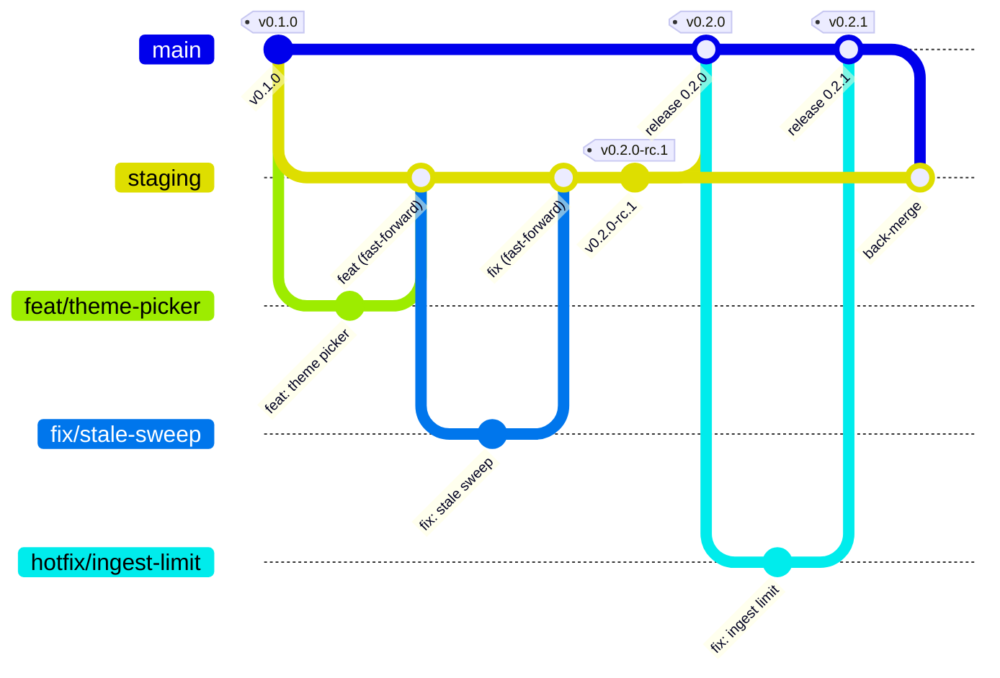

# Contributing to Uptellis

Thanks for helping. This page covers how branches, commits, pull requests and releases work. By taking part you agree to the [Code of Conduct](CODE_OF_CONDUCT.md). Security problems go through [SECURITY.md](SECURITY.md), never a public issue.

## Setup

Uptellis uses [Bun](https://bun.sh) as its only package manager and script runner (`bun`, `bunx`; not npm, npx or pnpm).

```sh
bun install
bun run collector:install
bun run dev
```

`bun run verify` runs Biome, the typechecks, the unit, integration and SSR tests, the Docker adapter tests (`bun run test:docker`) and the collector tests. CI runs exactly this. Changes to the Docker image are checked with `bun run docker:smoke` (needs Docker; builds and runs the image).

## Branches

| Branch | Holds | Receives |
| --- | --- | --- |
| `main` | Released code only; every commit on it is a release or a hotfix | Release PRs from `staging`, hotfix PRs |
| `staging` | The next release, integrated and tested | Pull requests from topic branches |
| `feat/*`, `fix/*`, `docs/*` | One change each, e.g. `feat/theme-picker`, `fix/stale-sweep`, `docs/install` | Your commits |
| `hotfix/*` | An urgent fix to the released code, cut from `main` | Your commits |

- Branch from `staging`, open the pull request against `staging`. Both long-lived branches require signed commits and the server does not sign, so pull requests are merged **fast-forward only**: rebase your branch onto `staging`, keep its commits as meaningful Conventional Commits (squash them yourself if needed), sign them, and the maintainer fast-forwards `staging` to it.
- A release PR takes `staging` to `main`, also fast-forward (`main` never has commits that `staging` lacks).
- A hotfix branches from `main`, is fast-forwarded into `main` by PR and released, and the same commit is then cherry-picked into `staging` by a PR so the fix is not lost in the next release.



## Commit messages

Every commit and every PR title follows [Conventional Commits](https://www.conventionalcommits.org). CI checks both with commitlint (`@commitlint/config-conventional`, see `commitlint.config.ts`). Check a message locally with:

```sh
echo "feat(admin): add revision diff" | bunx commitlint
```

The form is `type(optional scope): summary`, in the imperative, lower case, no trailing period:

| Type | Use for | Release effect |
| --- | --- | --- |
| `feat` | A new capability | Minor bump |
| `fix` | A bug fix | Patch bump |
| `perf` | A performance improvement | Patch bump |
| `docs` | Documentation only | None |
| `refactor` | Code change with no behaviour change | None |
| `test` | Tests only | None |
| `ci` | Workflows | None |
| `build` | Build system, dependencies | None |
| `chore` | Maintenance | None |
| `revert` | Reverting an earlier commit | Patch bump |

Examples:

```text
feat(themes): add a compact layout to Control Room
fix(ingest): reject payloads signed more than 120 s in the future
docs: explain the collector setup
refactor(engine): split incident derivation out of the store
ci: cache the Bun install
feat(api)!: rename /api/sites/:site/model to /api/sites/:site/snapshot

BREAKING CHANGE: clients of the model endpoint must use the new path.
```

A `!` after the type or a `BREAKING CHANGE:` footer marks a breaking change. Before 1.0 a breaking change bumps the minor version; from 1.0 on it bumps the major.

## Pull requests

Keep each PR to one change and fill in the template. Before you ask for review:

- [ ] The PR targets `staging` (or `main` for a hotfix or a release PR).
- [ ] The PR title is a Conventional Commit.
- [ ] `bun run verify` passes.
- [ ] New behaviour has tests; docs and `.dev.vars.example` match any changed configuration.
- [ ] No keys, hostnames or other private data in code, fixtures, screenshots or logs.
- [ ] Maintainers only: `bun run leak-check` passes. It scans the tree against a private denylist of names that must never appear in the public repo; it runs in the maintainers' CI and skips when no denylist is configured.

## Versioning

Uptellis follows [Semantic Versioning](https://semver.org). The version lives in `package.json`, and each release is a signed tag on `main`:

- `vX.Y.Z` on `main`: a release. Images are tagged `X.Y.Z`, `X.Y`, `X` and `latest`.
- `vX.Y.Z-rc.N` on `staging`: a release candidate, published as a GitHub pre-release. Its image gets only its full version tag.
- Every push to `staging` also publishes an image tagged `staging`.

## How releases are cut

Releases are cut on Forgejo, the source of truth; the GitHub mirror only publishes them.

1. On a branch from `staging`, bump `version` in `package.json` and add the new section to `CHANGELOG.md` (`## X.Y.Z (YYYY-MM-DD)`, grouped as Features, Bug Fixes, Documentation, from the Conventional Commits since the last tag). Commit it as `chore(release): X.Y.Z`, open a PR against `staging`, and fast-forward it.
2. Open a PR from `staging` to `main` titled `chore(release): promote X.Y.Z` and fast-forward it.
3. A maintainer tags the new `main` with a signed tag and pushes it: `git tag -s vX.Y.Z -m "Uptellis X.Y.Z" && git push origin vX.Y.Z`.
4. The mirror brings the tag to GitHub, where the release workflow publishes the GitHub release with that version's `CHANGELOG.md` section, builds the multi-arch container image, pushes it to GHCR with an SBOM and provenance attestation, and signs it with cosign (keyless).

For a release candidate, a maintainer tags the head of `staging` as `vX.Y.Z-rc.N` (signed); it is published as a GitHub pre-release and its image gets only its full version tag.

The project is developed on a Forgejo instance and mirrored to GitHub. Forgejo CI runs verify, commitlint and the leak check on every push and PR to `main` and `staging`. Forgejo pushes `main`, `staging` and tags to GitHub, where the GitHub release, the GHCR images and keyless signing happen. Pull requests from contributors on GitHub are welcome; a maintainer applies them on Forgejo and they come back through the mirror.
