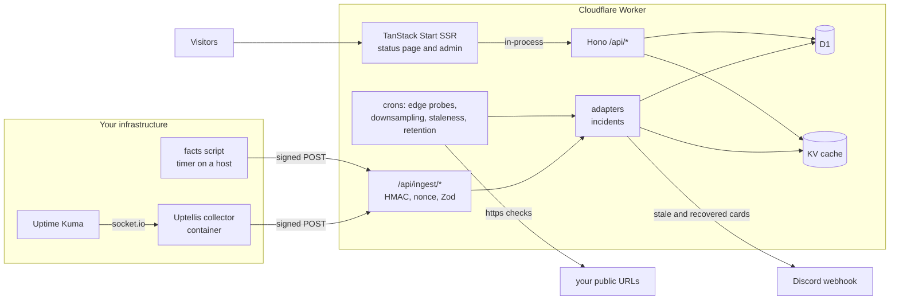

<p align="center">
  <picture>
    <source srcset="brand/uptellis-logo.svg" type="image/svg+xml">
    
  </picture>
</p>

<p align="center"><strong>Uptime, tell us.</strong> A self-hosted status page and monitor that runs on one Cloudflare Worker.</p>

<p align="center">
  <a href="https://github.com/borderlesstech/uptellis/actions/workflows/ci.yml"></a>
  <a href="LICENSE"></a>
  <a href="https://github.com/borderlesstech/uptellis/releases/latest"></a>
  <a href="https://github.com/borderlesstech/uptellis/pkgs/container/uptellis"></a>
</p>

Uptellis collects health data from the tools you already run, keeps it in one normalized model, and renders it as a fast, server-side rendered status page. Sources sign what they send, the page and its API can be kept private behind a viewer key, and everything is configured from an admin panel with a full revision history.

## Features

- **Status page with three themes**: sys.status, Control Room and Session, all sharing a command palette (`/` or Ctrl/Cmd+K) and keyboard shortcuts. Preview another theme with `?theme=<id>` without saving it.
- **Monitors from the tools you run**: today through an Uptime Kuma collector, infrastructure facts pushed by a script on your hosts, and edge probes the Worker runs itself every minute. Native monitors built into Uptellis are on the roadmap.
- **Incidents**: a service going down opens an incident and recovery resolves it; a source that stops reporting is flagged stale. The page shows 90 days of history.
- **Discord alerts**: one card when a source goes silent and one when it recovers, sent at most once however often a check runs.
- **Admin with revisions**: edit the site as a form or raw JSON, see a diff before saving, restore any earlier revision, import and export the site config.
- **Key rotation**: ingest keys are created and rotated in admin, stored sealed with AES-GCM, and a rotation switches over when the producer first signs with the new secret.
- **Rate limits and hardening**: signed ingest (HMAC-SHA256 with replay protection), per-client rate limits on ingest, the key gates and admin writes, body size caps and strict security headers.

## Screenshots

Screenshots of the three themes and the admin panel will be added with the first public release.

## Architecture



One Worker serves everything: Hono owns `/api/*`, TanStack Start (React 19) renders every page on the server, and page loaders call the API in-process. Data lives in D1 through Drizzle, the assembled model is cached in KV, and every payload is validated with Zod.

## Install

Both install paths are **coming in v1.0**.

- **Deploy to Cloudflare** (coming in v1.0): a one-click button that creates the Worker, D1 database and KV namespace in your Cloudflare account.
- **Docker image** (coming in v1.0): `ghcr.io/borderlesstech/uptellis`, multi-arch, signed with cosign, with an SBOM and provenance attestation.

Until then, run it from source as described below.

## Develop

Requires [Bun](https://bun.sh).

```sh
bun install
bun run collector:install        # the collector has its own lockfile
cp .dev.vars.example .dev.vars   # optional; empty keys leave the page and admin open locally
bun run dev                      # open the printed URL; /api/health answers JSON
```

Before every push:

```sh
bun run verify   # Biome, typecheck, unit + integration + SSR tests, collector tests
```

More in [docs/](docs): [THEMES.md](docs/THEMES.md) (themes and the view model), [SECURITY.md](docs/SECURITY.md) (threat model, gates, rate limits) and [OPERATIONS.md](docs/OPERATIONS.md) (secrets, rotation, restoring a revision).

## Branches and releases

`main` only ever holds released code; work lands on `staging` through pull requests from `feat/*`, `fix/*` and `docs/*` branches, and a release PR takes `staging` to `main`. Commits follow [Conventional Commits](https://www.conventionalcommits.org), versions follow [SemVer](https://semver.org), and release-please writes the [changelog](CHANGELOG.md). The full workflow is in [CONTRIBUTING.md](CONTRIBUTING.md).

Please report security problems privately as described in [SECURITY.md](SECURITY.md), and read the [Code of Conduct](CODE_OF_CONDUCT.md) before taking part.

## License

[MIT](LICENSE), copyright the Uptellis authors.
