<p align="center">
  <picture>
    <source srcset="docs/assets/uptellis-logo.svg" type="image/svg+xml">
    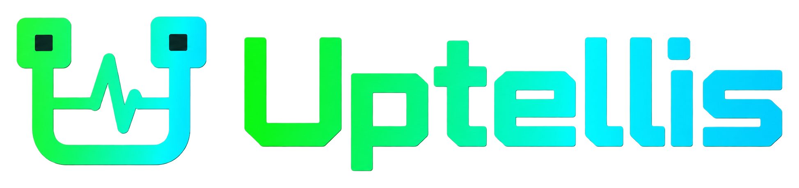
  </picture>
</p>

<p align="center"><strong>Uptime, tell us.</strong> A self-hosted status page and monitor, on Cloudflare or in Docker.</p>

<p align="center">
  <a href="https://github.com/bts-io/uptellis/actions/workflows/ci.yml"></a>
  <a href="LICENSE"></a>
  <a href="https://github.com/bts-io/uptellis/releases/latest"></a>
  <a href="https://github.com/bts-io/uptellis/pkgs/container/uptellis"></a>
</p>

Uptellis collects health data from the tools you already run, keeps it in one normalized model, and renders it as a fast, server-side rendered status page. Sources sign what they send, each site's page is public or private behind real accounts, and everything is configured from an admin panel with a full revision history.

## Features

- **Status page with nine themes**: three terminal-styled (sys.status, Control Room, Session) and six others (Classic, Editorial, Dashboard, Wallboard for a TV, Friendly, Minimal), all rendered on the server from one view model and sharing a command palette (`/` or Ctrl/Cmd+K). Preview another theme with `?theme=<id>` without saving it.
- **Native monitors**: HTTP(S) with status and keyword checks, TCP, ping and TLS certificate expiry. They run from the instance itself (Cloudflare's edge or the Docker server) and from `uptellis-agent` inside private networks, with a disk buffer so no result is lost offline. Failures are confirmed (retries, and a quorum across runners) before an incident opens ([monitors.md](docs/monitors.md)).
- **Other sources**: an Uptime Kuma collector, infrastructure facts pushed by a script on your hosts, and signed webhooks.
- **Maintenance windows**: one-off or weekly, in any time zone; covered services show maintenance, open no incident and page nobody.
- **Incidents**: a service going down opens an incident and recovery resolves it; a source that stops reporting is flagged stale. The page shows 90 days of history.
- **Public status**: an allow-listed `summary.json` (CORS), shields-style badges for the site and each service, and a widget to embed with a script or an iframe; off until a site turns it on, and each part shared only when allowed ([public.md](docs/public.md)).
- **Alerts on every channel**: Discord, Slack, webhooks (plain or signed), ntfy, Telegram, email (Cloudflare Email Service or SMTP) and SMS (Twilio), per site with the events each channel wants; one message when a service goes down and comes back or a source goes silent and recovers, sent once per channel, retried on failure, never inside a maintenance window ([monitors.md](docs/monitors.md#cards)).
- **Admin with revisions**: edit the site as a form or raw JSON, see a diff before saving, restore any earlier revision, import and export the site config.
- **Accounts and roles**: sign-in with email and password, optionally GitHub or Google (Better Auth); owner, admin and viewer roles; the first account becomes the owner and everyone else joins by a one-time invite. Each site is public or private.
- **API keys and JWTs**: site-scoped API keys (`ingest`, `read`, `agent`) for pushers and agents, shown once and revocable; short-lived JWTs for the signed-in user, verifiable by other services through the JWKS at `/api/auth/jwks`.
- **Key rotation**: ingest keys are created and rotated in admin, stored sealed with AES-GCM, and a rotation switches over when the producer first signs with the new secret.
- **Rate limits and hardening**: signed ingest (HMAC-SHA256 with replay protection), per-client rate limits on ingest, sign-in attempts and admin writes, body size caps and strict security headers.

## Screenshots

The demo site in each theme (healthy state). Open any of them live with `?theme=<id>`.

| | | |
|---|---|---|
| **sys.status** (`a-sys-status`)<br/>Terminal-styled console (dark) | **Control Room** (`b-control-room`)<br/>Dense operations dashboard with the topology (dark) | **Session** (`c-session`)<br/>A live shell session, typeset (dark) |
| 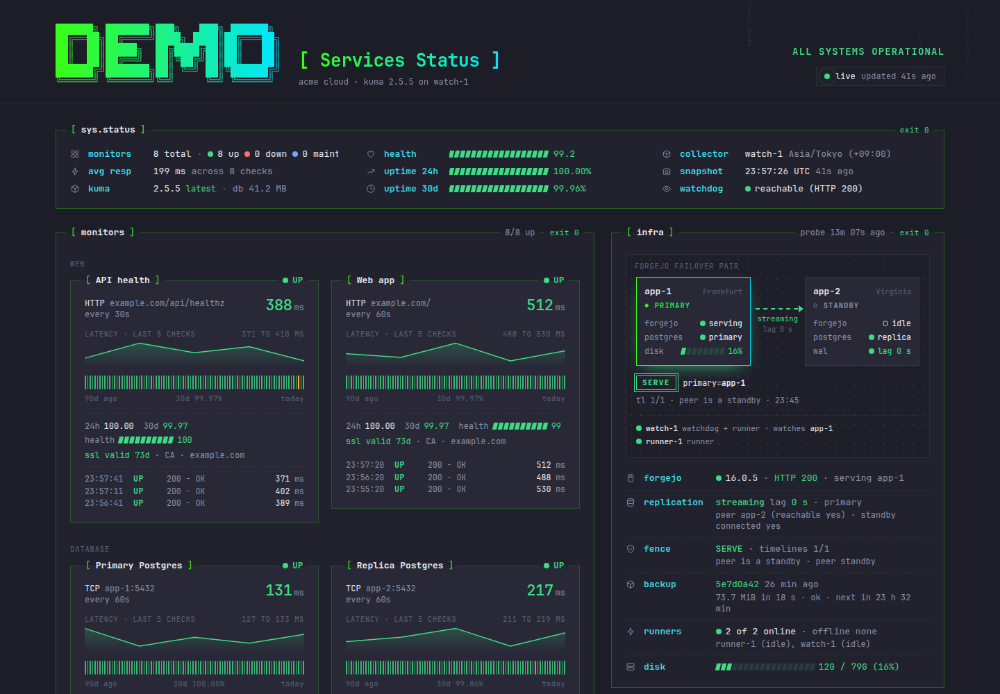 | 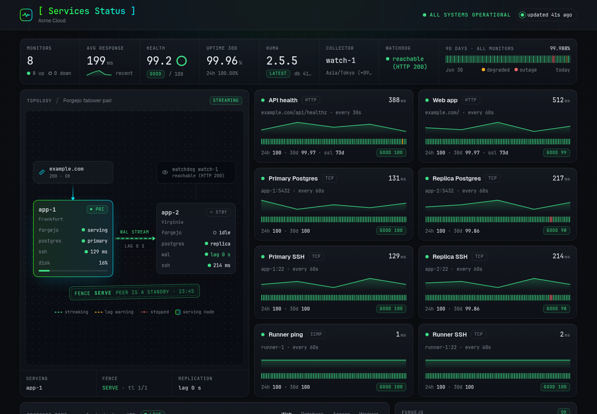 | 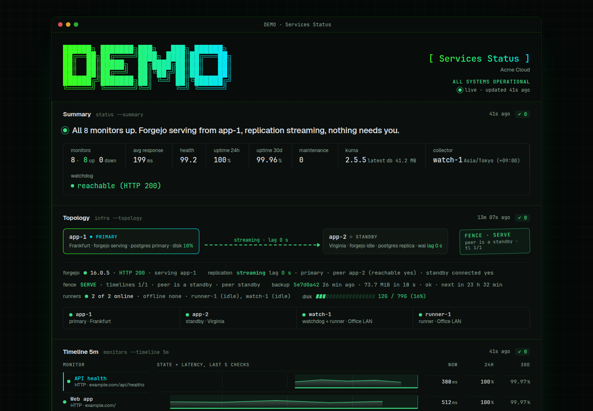 |
| **Classic** (`d-classic`)<br/>The familiar hosted status page (light) | **Editorial** (`e-editorial`)<br/>Reads like a report, serif headline (light) | **Dashboard** (`f-dashboard`)<br/>Cards and charts (light and dark) |
| 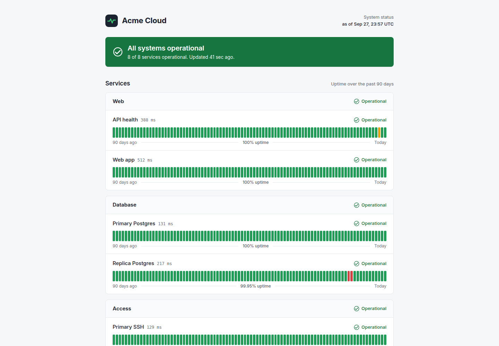 | 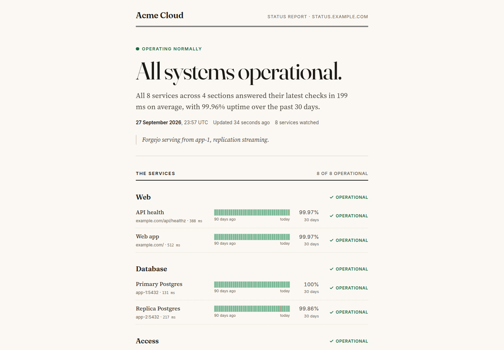 | 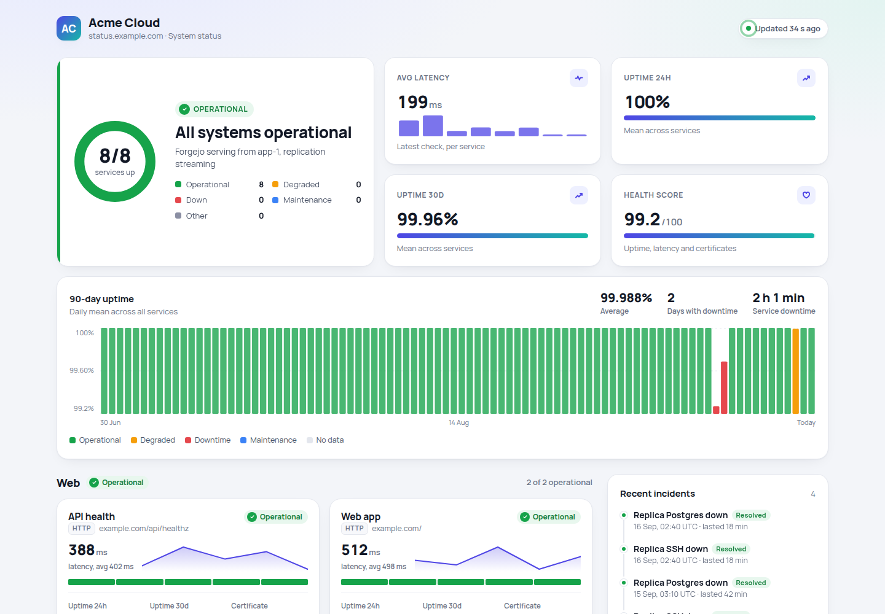 |
| **Wallboard** (`g-wallboard`)<br/>For a TV across the room (dark) | **Friendly** (`h-friendly`)<br/>Plain language for non-technical readers (light) | **Minimal** (`i-minimal`)<br/>One line and a compact list (light and dark) |
| 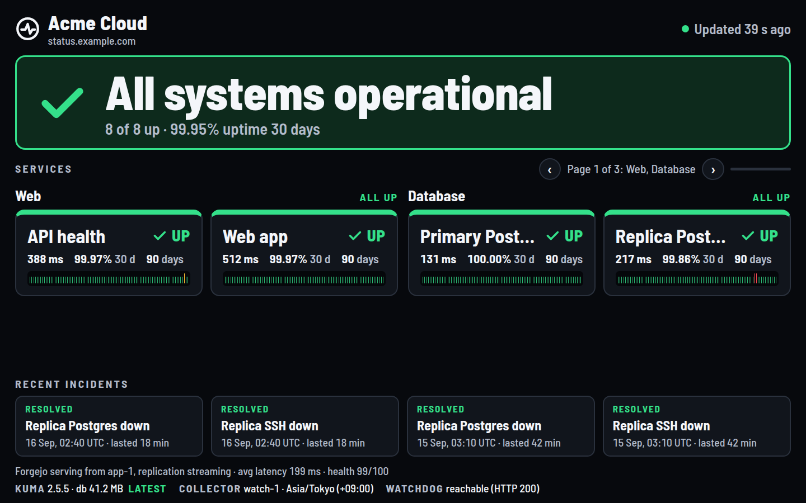 | 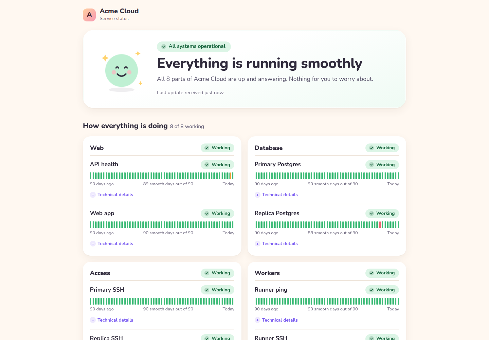 | 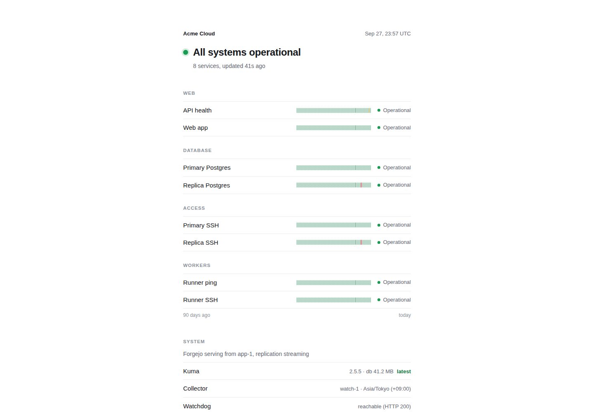 |

**Admin panel.** Each site's config (theme, profiles, sections, monitors, notification channels), revisions, import and export, sources and their ingest keys, users and theme previews, at `/admin`.

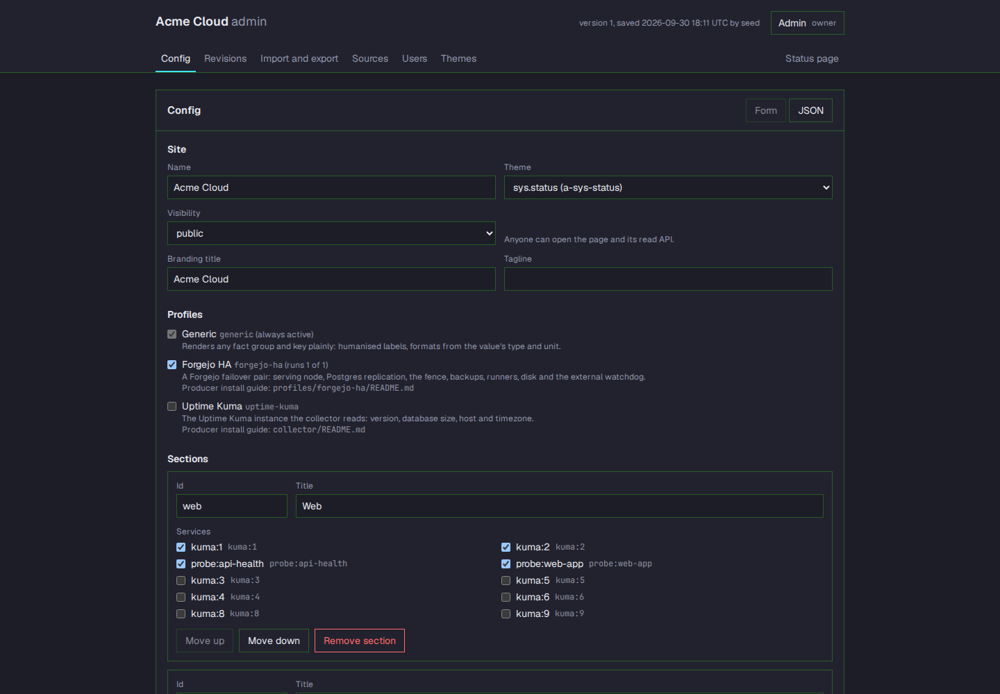

## Architecture

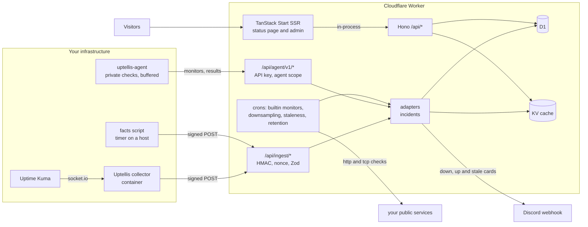

One app, two runtimes: a Cloudflare Worker (D1, KV, Cron Triggers) or a Docker container (Bun, one SQLite file, a built-in scheduler), behind one platform interface. Hono owns `/api/*`, TanStack Start (React 19) renders every page on the server, and page loaders call the API in-process. Data lives in SQL through Drizzle, the assembled model is cached, and every payload is validated with Zod.

## Install

Two install paths are planned ([roadmap](docs/roadmap.md), Phase 8):

- **Deploy to Cloudflare**: a one-click button that creates the Worker, D1 database and KV namespace in your Cloudflare account.
- **Docker image**: `ghcr.io/bts-io/uptellis`, multi-arch, signed with cosign, with an SBOM and provenance attestation. It is built for every release but not public yet.

Until then, run it from source as described below, or build and run the Docker image from a checkout: copy `docker.env.example` to `docker.env`, then `docker compose up -d --build` ([OPERATIONS.md](docs/OPERATIONS.md#docker)).

## Develop

Requires [Bun](https://bun.sh).

```sh
bun install
bun run collector:install        # the collector has its own lockfile
cp .dev.vars.example .dev.vars   # optional; empty keys leave the page and admin open locally
bun run dev                      # open the printed URL; /api/health answers JSON
```

Before every push:

```sh
bun run verify   # Biome, typecheck, unit + integration + SSR tests, Docker adapter tests, collector tests
```

More in [docs/](docs): [THEMES.md](docs/THEMES.md) (themes and the view model), [profiles.md](docs/profiles.md) (what facts mean: built-in profiles and writing one), [public.md](docs/public.md) (summary, badges and the widget), [SECURITY.md](docs/SECURITY.md) (threat model, accounts, roles, API keys, rate limits) and [OPERATIONS.md](docs/OPERATIONS.md) (first run, OAuth, Cloudflare and Docker deploys, secrets, rotation, backups, restoring a revision).

## Branches and releases

`main` only ever holds released code; work lands on `staging` through pull requests from `feat/*`, `fix/*` and `docs/*` branches, and a release PR takes `staging` to `main`. Commits follow [Conventional Commits](https://www.conventionalcommits.org), versions follow [SemVer](https://semver.org), and every release is a signed tag with its notes in the [changelog](CHANGELOG.md). The full workflow is in [CONTRIBUTING.md](CONTRIBUTING.md).

Please report security problems privately as described in [SECURITY.md](SECURITY.md), and read the [Code of Conduct](CODE_OF_CONDUCT.md) before taking part.

## License

[MIT](LICENSE), copyright the Uptellis authors.
