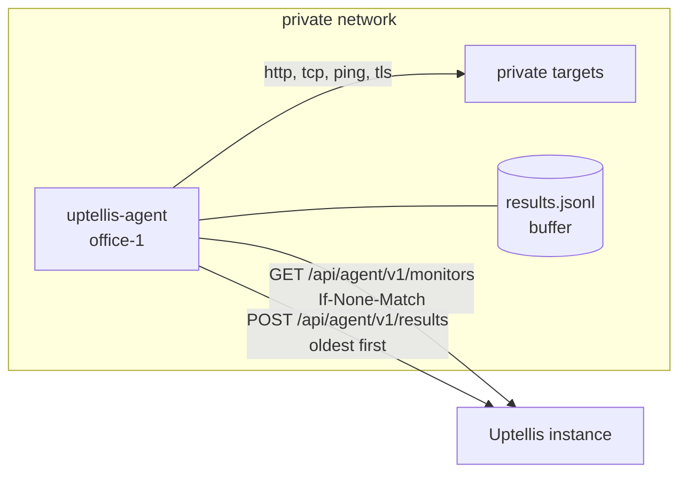

# Uptellis agent

`uptellis-agent` runs an Uptellis site's monitors from inside a private network (an office LAN, a tailnet,
a datacenter VLAN) and posts the results to the instance. It is a small Bun program, shipped as a single
binary for Linux (amd64, arm64) and as a container image. It fetches the monitors assigned to it, runs them
on the minute like the instance's own `builtin` runner, and keeps every result on disk until the instance
acknowledges it, so a network outage or a restart loses nothing.



```
src/main.ts            CLI: run forever, --once, --version
src/agent.ts           the poll, schedule and flush loops; graceful stop
src/client.ts          the agent API (src/shared/monitors/api.ts): monitors with ETag, results batches
src/buffer.ts          durable result buffer: append-only JSONL, fsync, compaction, 24 h / 50 000 cap
src/schedule.ts        minute alignment, bounded concurrency, interruptible sleeps
src/backoff.ts         transient and auth backoff with jitter
src/monitors-store.ts  the last monitor list and its ETag, kept for restarts while offline
src/checks.ts          the check library (src/checks) and its Bun transport, injected everywhere else
src/config.ts          environment, validated with zod; the API key from a file
src/shared.ts          the only import path into ../src/shared (the Phase 6 contract)
```

## Set it up

1. **Declare the agent** in the site config (or the admin editor), then list it among the `runners` of each
   monitor it should run. Only monitors run by agents alone may target private names or addresses; those
   targets are never shown on the page.

   ```json
   {
     "agents": [{ "id": "office-1", "name": "Office" }],
     "monitors": [
       { "id": "nas", "name": "NAS", "type": "ping", "host": "nas.lan", "runners": ["office-1"] },
       {
         "id": "intranet",
         "name": "Intranet",
         "type": "http",
         "url": "https://intranet.example.org/health",
         "runners": ["builtin", "office-1"]
       }
     ]
   }
   ```

2. **Create an API key** in the admin UI (API keys, on the site): scope `agent`. The key is bound to that
   site and shown once. Revoke it the moment it may have leaked; the agent then logs `auth_failed` and keeps
   its buffer until it gets a new key.

3. **Install** the agent with systemd or Docker (below), with `UPTELLIS_URL`, `UPTELLIS_RUNNER=office-1` and
   the key. `uptellis-agent --once` checks the setup: it fetches the monitors, runs each once, delivers the
   results and exits 0.

The agent reports as the source `probe:office-1`: when it goes silent, the site raises a `stale` incident
for it like for any other source, and monitors it shares with other runners are decided by those.

## systemd

Download `uptellis-agent-linux-amd64` (or `-arm64`) from the release, then:

```sh
install -m 755 uptellis-agent-linux-amd64 /usr/local/bin/uptellis-agent
install -d -m 700 /etc/uptellis-agent
install -m 600 agent.env.example /etc/uptellis-agent/agent.env      # edit UPTELLIS_URL, UPTELLIS_RUNNER
install -m 600 /dev/null /etc/uptellis-agent/api_key                  # then write the key into it
install -m 644 deploy/uptellis-agent.service /etc/systemd/system/
systemctl daemon-reload
systemctl enable --now uptellis-agent
journalctl -u uptellis-agent -f
```

`deploy/uptellis-agent.service` runs the agent as a dynamic user with its state in
`/var/lib/uptellis-agent` (`StateDirectory`), the key as a systemd credential, `ProtectSystem=strict`,
`NoNewPrivileges`, a system call filter and a single capability, `CAP_NET_RAW`, for ping monitors.

## Docker

The image is `ghcr.io/bts-io/uptellis-agent` (amd64, arm64). On the host (files outside git, the key owned
by uid 1000 because compose file secrets are bind mounts, mode 600):

```
/etc/uptellis/agent.env         from agent.env.example
/etc/uptellis/agent_api_key     the API key
```

```sh
docker compose -f agent/compose.yaml up -d          # add --build to build from this checkout
docker logs -f uptellis-agent
```

`compose.yaml` runs it `read_only` as uid 1000 with `cap_drop: ALL`, `no-new-privileges`, a named volume
on `/data` for the buffer, a tmpfs on `/tmp` for the liveness file (the healthcheck), and a 30 s stop
grace period. To build the image yourself, from the repo root:

```sh
docker build -f agent/Dockerfile -t uptellis-agent .
```

### Ping

Ping monitors use the system `ping` (iputils). As a non-root user it needs one of:

- **unprivileged ICMP**: `net.ipv4.ping_group_range` covering the user's group. `compose.yaml` sets it for
  the container (Docker 20.10 and later do by default); on a host, `sysctl net.ipv4.ping_group_range`.
- **`CAP_NET_RAW`**: the systemd unit grants it as an ambient capability; in compose, uncomment
  `cap_add: [NET_RAW]` where the sysctl is not allowed.

## Configuration

| Variable | Default | Notes |
|---|---|---|
| `UPTELLIS_URL` | required | the instance, e.g. `https://status.example.org`; https unless localhost or `UPTELLIS_ALLOW_HTTP=1` |
| `UPTELLIS_API_KEY_FILE` | | file holding the key (mode 600 or 400; 440 inside systemd's `CREDENTIALS_DIRECTORY`, as systemd 253 and later create credentials); preferred |
| `UPTELLIS_API_KEY` | | the key itself, for local runs; one of the two is required |
| `UPTELLIS_RUNNER` | required | the agent id declared in the site's `agents`, e.g. `office-1` |
| `UPTELLIS_DATA_DIR` | `/var/lib/uptellis-agent` | buffer and last monitor list; `/data` in the image |
| `UPTELLIS_CONCURRENCY` | `8` | checks running at once (1 to 64) |
| `UPTELLIS_LIVENESS_FILE` | none | touched every minute; `/tmp/agent-alive` in the image |
| `UPTELLIS_ALLOW_HTTP` | | `1` allows an `http://` instance (a trusted LAN only) |
| `LOG_LEVEL` | | `debug` for debug lines |

Logs are JSON lines on stderr with counts, monitor ids and statuses only: never the key, a target or a
result message.

## Behaviour

- **Monitors.** `GET /api/agent/v1/monitors` at start and every `pollS` the instance asks for, with
  `If-None-Match`; a 304 keeps the list. The list and its ETag are saved in the data directory, so a
  restart while the instance is unreachable keeps checking.
- **Schedule.** Each monitor runs on the minutes where `floor(epoch minutes) % (intervalS / 60) == 0`, the
  same moments as the `builtin` runner, at most `UPTELLIS_CONCURRENCY` at a time. A monitor whose previous
  check is still running is skipped that minute (`check.overrun`).
- **Buffer.** Each result is appended to `results.jsonl` and fsynced before it counts as taken. Results
  leave the buffer only when the instance answered for them. The buffer keeps at most 24 hours (the
  instance ignores older results) and 50 000 results, evicting the oldest first, and is compacted once it is
  mostly acknowledged lines.
- **Flush.** After each minute's checks, every `pollS`, and when a backoff ends, the buffer is sent oldest
  first in batches of at most 500 results and 256 KiB, with `Authorization: Bearer` and
  `X-Uptellis-Runner`:

  | Answer | What the agent does |
  |---|---|
  | 2xx | drops the batch from the buffer, sends the next |
  | 400 | logs `results.rejected` and drops the batch (resending it would never succeed) |
  | 401, 403 | logs `auth_failed` with a hint, keeps buffering, retries after 5 min doubling to 30 min |
  | 413 | halves the batch and retries; a single result that is still too large is dropped |
  | 429, 5xx, no answer | keeps the batch, retries after 5 s doubling to 5 min with jitter (at least `Retry-After`) |

  Resending a result is harmless (the instance identifies it by monitor, runner and time), so a crash
  between a 2xx and the buffer update only repeats that batch.
- **Stop.** On SIGTERM or SIGINT the agent starts no new checks, waits up to 10 s for running ones, flushes
  once and exits 0.

## Develop

```sh
cd agent
bun install
bun test                  # unit tests and a fake Uptellis (Bun.serve) end to end
bun run typecheck
bun run build             # dist/uptellis-agent-linux-amd64 and -arm64 (bun build --compile)
UPTELLIS_URL=... UPTELLIS_API_KEY=... UPTELLIS_RUNNER=office-1 UPTELLIS_DATA_DIR=./data bun run once
```

From the repo root: `bun run agent:check`, `bun run agent:test` and `bun run agent:build`.
