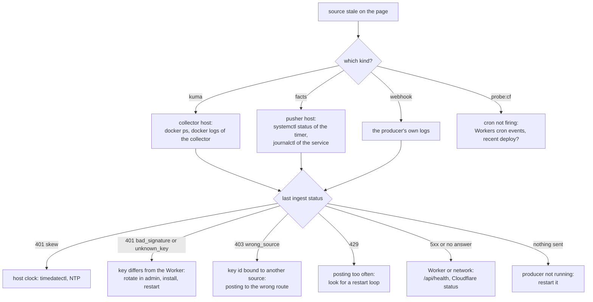
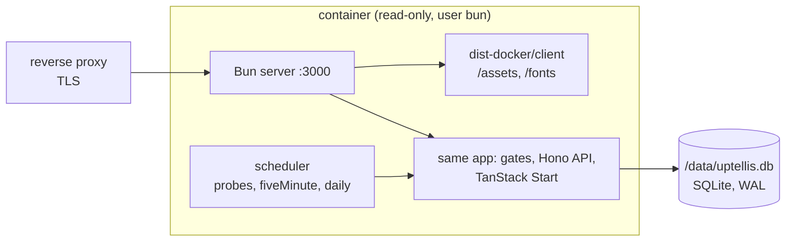

# Operations

How to deploy Uptellis (on Cloudflare or in Docker), set and rotate its secrets, undo a config change, bring a stale producer back, and read what the Worker tells you. How the parts fit together is in [architecture.md](architecture.md); the security model behind all of this is in [SECURITY.md](SECURITY.md). Examples use the demo site `demo` at `status.example.com`; replace them with your own.

## Deploy

Uptellis runs on Cloudflare Workers (D1, KV, Workers Static Assets, Rate Limiting, Cron Triggers), described first, or in Docker on any host (Bun and one SQLite file), described in [Docker](#docker). Both run the same app; only the platform layer differs ([architecture.md](architecture.md#platform-layer)).

### First deploy

1. Install and check: `bun install && bun run collector:install && bun run verify`.
2. Log in to Cloudflare: `bunx wrangler login` (or set `CLOUDFLARE_API_TOKEN` and `CLOUDFLARE_ACCOUNT_ID` in CI).
3. Create the D1 database and the KV namespace named in `wrangler.jsonc` and add the ids they print to their bindings (the migrations step needs the database before the first `wrangler deploy` could provision it):

   ```sh
   bunx wrangler d1 create uptellis-db
   bunx wrangler kv namespace create uptellis-cache
   ```

4. Write your site config as `sites/<slug>.json` (start from `sites/demo.json`), and set `SITE_DEFAULT` in `wrangler.jsonc` to its slug. To serve it on your own hostname, add a custom domain route to `wrangler.jsonc` and list the hostname in the config's `hostnames`.
5. Set the secrets ([below](#secrets)): at least `VIEWER_KEY`, `VIEWER_COOKIE_SECRET`, `ADMIN_KEY` and `SOURCE_MASTER_KEY`.
6. `bun run deploy`: applies the D1 migrations (`db:migrate:remote`), builds, and runs `wrangler deploy`.
7. Check it: `curl -s https://status.example.com/api/health` answers `{ ok, service, version, build, commit }`.

### Later deploys

Run `bun run verify`, then `bun run deploy`, ideally from CI on merges to your release branch. `bun run deploy` is the only deploy path: it applies migrations before the new code is live.

- Every migration must work with the code that is deployed now: add first, drop in a later release.
- To roll back, revert the change and deploy again. A migration is never rolled back, only followed by a new one.
- `/api/health` reports the deployed `commit`, so a CI smoke step can wait until it matches.

### Bindings

| Binding | Kind | Used for |
| --- | --- | --- |
| `DB` | D1 `uptellis-db` | everything durable: models, heartbeats, incidents, configs, keys, nonces, notifications |
| `CACHE` | KV `uptellis-cache` | `latest:<site>` (assembled model) and `config:<site>` (current config) |
| `ASSETS` | Static Assets | client bundle and fonts from `dist/client` |
| `INGEST_RATE_LIMIT`, `GATE_RATE_LIMIT`, `ADMIN_WRITE_RATE_LIMIT` | Rate Limiting (namespace ids 1001 to 1003) | see [Rate limits](#rate-limits) |
| `SITE_DEFAULT` | var | the site a request renders when its host matches no site's `hostnames` |

## Crons

Three Cron Triggers in `wrangler.jsonc`, exactly the `JOBS` expressions of `src/platform/types.ts`; `src/platform/cloudflare/scheduled.ts` maps each trigger to its job (`src/worker/cron.ts`):

| Trigger | Job |
| --- | --- |
| `* * * * *` | edge probes of the configured public URLs |
| `*/5 * * * *` | downsample heartbeats, source staleness sweep, stale incidents and their cards |
| `17 3 * * *` (03:17 UTC) | retention pruning |

A newly added or changed cron trigger does not fire right after the deploy. Cloudflare takes several minutes to propagate it (its documentation says up to 15); in practice the first run of a new every-minute trigger can come 5 to 10 minutes after the deploy. Before suspecting the code, check the Worker's cron events in the Cloudflare dashboard or the scheduled invocations in the Workers analytics. Each run logs one JSON line (`evt: "cron"`, the job name and counts), see [Logs](#logs).

The integration tests (`tests/integration`) drive `runJob` with a pinned clock, which is the quickest way to see what a job does.

## Secrets

Worker secrets are set with `bunx wrangler secret put <NAME>`, which prompts for the value. Never pass a value on the command line or paste it into a chat or an issue. A `secret put` takes effect at once, without a deploy. Generate values with `openssl rand -hex 32` unless noted. For local development, put them in `.dev.vars` (gitignored; template in `.dev.vars.example`); an empty `VIEWER_KEY` leaves the local gate open.

| Secret | What it does | Rotating it |
| --- | --- | --- |
| `VIEWER_KEY` | The `?key=` that opens the dashboard; part of the `uptellis_view` cookie key | Every viewer cookie stops working. Put the new value and send the new link (`https://status.example.com/?key=<new>`) to the people who need it |
| `VIEWER_COOKIE_SECRET` | HMAC secret for both cookies | Every viewer and admin cookie stops working; the keys stay the same, so everyone opens their link once more |
| `ADMIN_KEY` | The `?admin=` that opens `/admin`; part of the `uptellis_admin` cookie key. Without it there is no admin at all | Every admin cookie stops working. Put the new value and open `/admin?admin=<new>` |
| `SOURCE_MASTER_KEY` | 32 random bytes, base64 (`openssl rand -base64 32`): seals the ingest keys stored in D1 | Every key sealed in D1 stops verifying. See [Master key](#master-key) |
| `INGEST_KEY_<ID>` | Optional env fallback for a producer's HMAC key, used while its key id has no D1 row (binding in `src/worker/ingest/keys.ts`) | Rotate in admin instead, which moves the key into D1 ([Ingest keys](#ingest-keys)); then delete the env secret |
| `DISCORD_WEBHOOK_URL` | Optional: the Discord webhook the stale and recovered cards are posted to | In the channel settings create a new webhook, put its URL, send a test card (`POST /api/admin/notify/test`), then delete the old webhook |

The Worker only reads secrets; it never logs or returns them.

### Ingest keys

Each producer signs with its own key id, bound to one site and one source. Create and rotate keys in `/admin`, tab **Sources**:

- **Add a source** creates the source in the config (if it is new) and issues its key. The secret is shown once.
- **Rotate** on a key id issues a new secret. The old one keeps working until the producer's first request signed with the new one, which promotes it; from then on the old secret is rejected.

To rotate:

1. **Rotate** in the Sources tab and copy the new secret.
2. Install it on the producer and restart it (collector: its key file, see `collector/README.md`; a facts pusher: the `INGEST_KEY=` line of its env file).
3. The Sources tab shows the new key as current with a recent "last used".

The admin API does the same: `POST /api/admin/sites/<slug>/sources/<keyId>/rotate`. A key that was env-only (`INGEST_KEY_<ID>`) moves into D1 on its first rotation; delete the Worker secret once the producer uses the new key (`bunx wrangler secret delete INGEST_KEY_<ID>`). For a manual rotation without admin, `INGEST_KEY_<ID>_NEXT` is accepted alongside the current env secret: set it, move the producer to it, copy it into the current slot, delete `_NEXT`.

### Master key

`SOURCE_MASTER_KEY` has no second slot: after it changes, the keys sealed in D1 no longer open and their producers get 401 until they have a new key. Plan it as a short window (the collector buffers 60 minutes of heartbeats):

1. `bunx wrangler secret put SOURCE_MASTER_KEY` with a new value.
2. At once, rotate every key in the Sources tab (the new secrets are sealed with the new master key) and install each on its producer.
3. Watch the Sources tab until every source is fresh again.

## Restoring a config revision

Every save of a site config is a new revision in D1 (`site_configs`); nothing is overwritten.

1. Open `/admin`, tab **Revisions**. Revisions are listed newest first, with who saved them and a note.
2. **Restore** the version you want. Restoring saves it again as a new revision, so the history stays intact and the restore itself can be undone.
3. Pages pick it up within about 15 seconds (isolate cache, then KV `config:<site>`).

Tab **Import and export** exports `sites/<slug>.json` and imports one; run the import as a dry run first to see the diff. The same routes are in the admin API: `GET /api/admin/sites/<slug>/config/revisions` and `POST .../revisions/<version>/restore`.

## A producer is stale

A source is `aging` past 2 times its expected interval and `stale` past 5 times. The 5-minute cron opens a `stale` incident, the page shows the stale banner and, with `DISCORD_WEBHOOK_URL` set, a card is posted. `GET /api/sites/<slug>/sources` (with a viewer cookie) lists each source's age and freshness.



Producers log JSON lines with status codes and reason codes only, so their logs are safe to read and paste.

- **Collector down, Kuma up.** `docker compose -f collector/compose.yaml up -d` from its checkout. Heartbeats from the last 60 minutes are sent on the next ticks; older gaps are backfilled from the last 100 beats per monitor that Kuma resends on login.
- **Kuma down.** The collector keeps posting with Kuma marked unreachable, so the page says Kuma is down rather than stale. Fix Kuma first.
- **Facts pusher.** Start its service once to push now; run the script with `--dry-run` to gather and sign without sending ([profiles/forgejo-ha](../profiles/forgejo-ha/README.md) shows a complete example).
- **Upgrades or reboots of a producer host** are best run detached (`systemd-run`) rather than in a foreground SSH session, and only when you have a second way in.

## Rate limits

Three Workers Rate Limiting bindings, applied before the gates (`src/worker/middleware/rate-limit.ts`). Counters are kept per Cloudflare location, so the limits are approximate: a brake on floods and key guessing, not a quota. Over the limit the Worker answers 429 with `retry-after: 60`.

| Binding | Counts | Key | Limit |
| --- | --- | --- | --- |
| `INGEST_RATE_LIMIT` | `POST /api/ingest/*`, before the HMAC check | claimed key id and client IP | 60 per minute |
| `GATE_RATE_LIMIT` | requests with `?key=` or `?admin=`, and requests a gate answered 404 | client IP | 20 per minute |
| `ADMIN_WRITE_RATE_LIMIT` | non-GET requests to admin paths | client IP | 30 per minute |

The collector posts once a minute and a facts pusher typically every 15 minutes, so 60 per minute leaves room for a catch-up burst. A producer that hits 429 is almost always in a restart loop. The budgets are `RATE_LIMITERS` in `src/platform/types.ts`; `ratelimits` in `wrangler.jsonc` must match them (a unit test checks it). In Docker the same budgets are counted in memory in fixed one-minute windows, exact for the one process and reset on restart; the client address is the connection's, or the last `X-Forwarded-For` hop with `TRUST_PROXY=1`. Page views and API reads with a valid cookie, and `/api/health`, are never counted.

## Logs

The Worker logs JSON lines with an `evt` field, reason codes, ids and counts, and only the error name on failure. It never logs a payload, key, cookie, request body or SQL.

| `evt` | When | Fields |
| --- | --- | --- |
| `ingest` | every ingest request | `route`, `status`, `reason` on a rejection, `keyId`, `source`, counts of services, heartbeats, facts, incidents opened and resolved; `step: "key_promoted"` when a rotated key takes over |
| `cron` | every job run | `job` (`probes`, `fiveMinute`, `daily`), incidents opened and resolved; for probes also sites, checks, down results and failed sites |
| `notify` | every card | `kind` (`open`, `resolve`), `sent`, the error code on failure |
| `error` | an unhandled error | `name` only |
| `scheduler` | Docker: a job failed, or was skipped because its previous run is still going | `job`, `step` (`failed`, `skipped_overlap`), the error `name` |
| `server` | Docker: start and stop | `step` (`listening`, `stopping`, `stopped`), `port`, `signal` |
| `background` | Docker: background work (a card, a cache warm-up) failed | `name` only |

In Docker they go to stdout (`docker compose logs -f`). On Cloudflare read them live with `bunx wrangler tail --format json`, or in the Workers Logs view of the dashboard (`observability` is on in `wrangler.jsonc`). Workers invocation logs are off on purpose: they record each request's URL, and the login links carry the viewer and admin keys in their query string. Keep them off.

Error responses carry a code and a fixed message (`{ "error": "internal", "message": "Something went wrong" }`); ingest rejections add a reason (`missing_headers`, `malformed_headers`, `skew`, `unknown_key`, `bad_signature`, `wrong_source`) or the error `replay` or the field paths that failed validation, never values.

## Docker

The image runs everything in one Bun process: the status page, the API and admin, the static client files, and its own scheduler for the three jobs of [Crons](#crons) (at the start of each UTC minute; a job never overlaps itself). Data lives in one SQLite file in the `/data` volume. The container runs as the unprivileged `bun` user, listens on port 3000, and reports its health from `/api/health`.



### Run it

1. Copy `docker.env.example` to `docker.env` (gitignored) and fill it in: at least `VIEWER_KEY`, `VIEWER_COOKIE_SECRET`, `ADMIN_KEY` and `SOURCE_MASTER_KEY` for anything reachable from outside ([Secrets](#secrets) explains each).
2. `docker compose up -d --build` builds the image from this checkout and starts it with the named volume `uptellis-data`. Set `UPTELLIS_PORT` to publish another host port than 3000.
3. Check it: `curl -s http://localhost:3000/api/health`.
4. Put a TLS-terminating reverse proxy in front for a public hostname (the cookies are `Secure`, so the gates need HTTPS), list the hostname in the site config's `hostnames`, and set `TRUST_PROXY=1` so the rate limits see client addresses.

To build the image alone: `docker build -t uptellis --build-arg VERSION=$(bun -p "require('./package.json').version") .` The build stage runs on the build machine's platform and the runtime stage only copies files, so both architectures build anywhere: with a multi-platform builder (`docker buildx create --use` once), `docker buildx build --platform linux/amd64,linux/arm64 -t <registry>/uptellis:<version> --push .`.

Without Docker, the same server runs from a checkout: `bun run build:docker && bun run start` (Bun 1.3.14 or newer; `DATABASE_PATH` defaults to `./data/uptellis.db`).

### Environment and secrets

| Variable | What it does |
| --- | --- |
| `SITE_DEFAULT` | the site a request renders when its host matches no site's `hostnames` (default in the image: `demo`) |
| `VIEWER_KEY`, `VIEWER_COOKIE_SECRET`, `ADMIN_KEY`, `SOURCE_MASTER_KEY`, `DISCORD_WEBHOOK_URL`, `INGEST_KEY_<ID>` | as in [Secrets](#secrets) |
| `PORT` | the port inside the container (default 3000; the health check follows it) |
| `DATABASE_PATH` | the SQLite file (default in the image: `/data/uptellis.db`) |
| `TRUST_PROXY` | `1` behind a reverse proxy: the client address is the last `X-Forwarded-For` hop |

Any of these can be read from a file instead: set `NAME_FILE=/run/secrets/<name>` rather than `NAME` (Docker and Compose secrets mount there). A set `NAME` wins over `NAME_FILE`; values are trimmed. Secrets and settings are read once at startup, so a change needs a restart (`docker compose up -d` after editing `docker.env`).

### Backups

The volume holds `uptellis.db` and, while it runs, its `-wal` and `-shm` files; copying them from a live container can catch a half-written state. Take a consistent copy with SQLite's `VACUUM INTO` instead, then move it off the host:

```sh
docker compose exec uptellis bun -e 'new (require("bun:sqlite").Database)("/data/uptellis.db").exec("VACUUM INTO \x27/data/backup.db\x27")'
docker compose cp uptellis:/data/backup.db ./uptellis-$(date +%F).db
docker compose exec uptellis rm /data/backup.db
```

To restore, stop the container, replace `uptellis.db` in the volume with the backup (and delete any `-wal` and `-shm` next to it), and start it again. Site configs can also be exported from admin as `sites/<slug>.json`, but that covers configs only.

### Upgrades

Pull or build the new image and recreate the container (`docker compose up -d --build`). On startup the server applies any pending migrations from `migrations/` (the same files D1 uses, tracked in the `__drizzle_migrations` table) before it takes requests. Migrations are only ever added, never rolled back, so take a backup before upgrading; to go back, restore that backup with the older image. On `docker compose down` or `docker stop` the server stops taking requests, lets running requests, jobs and Discord cards finish, then closes the database (`stop_grace_period` in `compose.yaml` gives it 30 s).

### Smoke test

`bun run docker:smoke` builds the image and checks it on a throwaway volume: the first request and `/api/health`, a page and one of its assets, a config saved through the admin API, a scheduler run, the health check, a clean exit on SIGTERM, and the saved config in a new container on the same volume. `IMAGE=<ref>` tests an existing image instead; `PLATFORM=linux/arm64` builds and runs another platform (needs emulation on an amd64 host).
