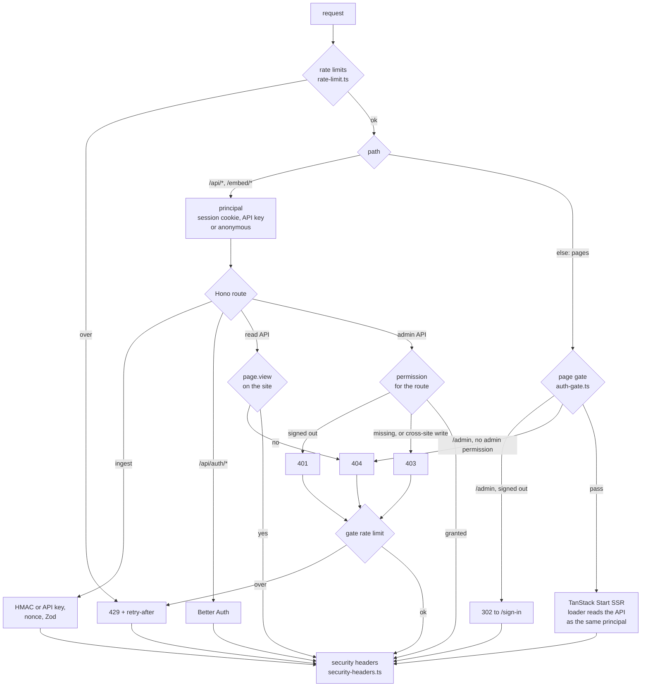

# Security

How Uptellis is protected, what is reachable without an account, and how to report a problem. Running it (deploys, secrets, rotation, incidents) is in [OPERATIONS.md](OPERATIONS.md).

## Threat model

A status page built on Uptellis can show the health of private infrastructure: host names, service names, replication state, versions, disk use. A site is private unless its config says `"visibility": "public"`, and nothing a page shows may help an attacker reach the hosts behind it.

| Asset | Threat | Defence |
| --- | --- | --- |
| A private site's page and API | Anyone on the internet reading it | Accounts: 404 unless a signed-in user or a `read` API key of that site asks |
| The site config, ingest and API keys, users | Changes by someone who may not make them | A permission per admin route (roles), same-origin check on writes, admin write rate limit |
| Accounts | Password guessing, stolen sessions, self sign-up | Sign-in rate limit, scrypt password hashes, httpOnly Secure SameSite=Lax session cookies, sign-up closed after the first account, one-time invites |
| The data (D1) | Forged or replayed producer posts | HMAC-SHA256 per key id, 120 s window, single-use nonces, key bound to one site and source |
| Private addresses, tokens, emails | Leaking through the page or the API | Collector and pusher map addresses to host names; the Worker rejects address literals in display fields; a whole-repo literal scan test |
| Keys, tokens and invite links | Guessing, leaking through logs or referrers | 256-bit secrets stored only as hashes (API keys, invites) or sealed (ingest keys), rate limits, constant-time compare, `Referrer-Policy: no-referrer`, invocation logs off |
| The Worker and D1 | Floods, oversized bodies | Per-client rate limits, 256 KB body cap before any hashing, retention pruning |
| Browsers of viewers | XSS, clickjacking, cross-site requests | CSP, `X-Frame-Options`, `frame-ancestors`, SameSite cookies, same-origin check |

Out of scope: an attacker with access to your Cloudflare account, your repository or its CI, or root on a producer host. Those can already change the Worker, its secrets or the data at the source.

## Request path

Every request runs through the same steps in `src/worker/serve.ts` (both runtimes). Assets under `/assets/*` and `/fonts/*` are served by Workers Static Assets and never reach the Worker (`run_worker_first` in `wrangler.jsonc`).

## Accounts and access

Accounts come from [Better Auth](https://www.better-auth.com) (`src/worker/auth/instance.ts`) over the platform database; what each account may do comes from its role (`src/shared/auth.ts`). Without `BETTER_AUTH_SECRET` there are no accounts: everyone is anonymous and only public sites can be seen.

### Roles and permissions

| Permission | What it allows | owner | admin | viewer |
| --- | --- | --- | --- | --- |
| `page.view` | a private site's page and read API | yes | yes | yes |
| `config.edit` | edit site configs, restore revisions, import, the notification test | yes | yes | |
| `sources.manage` | create sources, rotate ingest keys, create and revoke API keys | yes | yes | |
| `users.manage` | invite users, change roles, remove users | yes | yes | |
| `instance.manage` | instance settings (owner only) | yes | | |

- **The first account is the owner.** `POST /api/setup` works only while there are no users; afterwards it answers 409 and public sign-up (`/api/auth/sign-up/email`) does not exist (404). If two setups race, only the first becomes the owner and the other account is removed.
- **Everyone else joins by invite.** A user with `users.manage` creates an invite with a role (and optionally the one address that may use it). It yields a one-time link, `<PUBLIC_URL>/invite/<token>` (256-bit token, stored only as its SHA-256), that expires after 7 days. Accepting it creates the account with that role and signs it in; the invite is claimed in one guarded update, so a link creates at most one account.
- **Only an owner touches the owner role.** Only an owner may invite an owner, promote someone to owner, or change or remove an owner. The last owner can never be demoted or removed: the check runs inside the same SQL statement as the change, so two admins acting at once cannot leave the instance without an owner.
- **Changes apply at once.** Sessions are checked against the database on every request (no cookie cache), so a new role or a removed user takes effect on the next request; removing a user deletes its sessions.

### Sign-in and sessions

- **Email and password** always. Passwords are 12 to 128 characters and stored as scrypt hashes (Better Auth's default).
- **GitHub and Google** only when both the client id setting and the secret are set ([OPERATIONS.md](OPERATIONS.md#sign-in-with-github-or-google)). OAuth never creates an account and never links one implicitly: a signed-in user links a provider (`POST /api/auth/link-social`) and can sign in with it from then on.
- **The session cookie** is `__Secure-uptellis.session_token`: a random token signed with `BETTER_AUTH_SECRET`, `HttpOnly`, `Secure`, `SameSite=Lax`, `Path=/`, valid 7 days and renewed daily while in use. The session behind it lives in the database (`sessions`); signing out or removing the user ends it.
- **CSRF.** Better Auth checks the `Origin` of its own writes against `PUBLIC_URL`. Every other write (the admin API, setup, accepting an invite) must be same-origin: `Sec-Fetch-Site: same-origin`, or an `Origin` equal to the request's own; otherwise 403. `SameSite=Lax` rather than `Strict`, so following a link to the dashboard from another site keeps you signed in.

### Who may see what

Every request gets a principal (`src/worker/auth/principal.ts`): a signed-in user, an API key, or anonymous. `can()` in `src/shared/auth.ts` decides.

- **Site pages and the read API** (`/api/sites/:site/*`) need `page.view` on that site. A public site is open to everyone. A private site answers 404 to anyone else, exactly as a site that does not exist, so a private site is never revealed. The page's loader calls the read API through the in-process bridge as the same principal, so the page answers 404 too.
- **The admin API** (`/api/admin/*`) needs the permission of each route: 401 JSON when signed out, 403 when signed in without it (or with an API key).
- **The admin UI** (`/admin`, `/admin/*`) redirects a signed-out visitor to `/sign-in?next=<path>` (to `/setup` while no account exists) and answers 404 to a signed-in user without an admin permission.
- **Always open:** `GET /api/health`, the ingest routes (they authenticate themselves), Better Auth's routes, `GET /api/me`, the setup and invite routes, and the account pages `/setup`, `/sign-in` and `/invite/<token>`.

### API keys

API keys are for pushers and agents that cannot sign in. A key belongs to one site and has scopes from `API_KEY_SCOPES`: `ingest` (post to that site's ingest routes) and `read` (that site's page and read API, even when private). Users with `sources.manage` create and revoke them (`/api/admin/sites/:site/api-keys`).

- The key is `upt_<id>_<secret>`: the id finds it, the secret (32 random bytes) proves it. Only the SHA-256 of the secret is stored, and the whole key is shown once, when it is created.
- It is sent as `Authorization: Bearer <key>`. An unknown, revoked or malformed key makes the request anonymous; it never grants admin access.
- A revoked key stays listed with `revokedAt` and never works again. `lastUsedAt` is updated at most once a minute.

### JWT and JWKS

Better Auth's JWT plugin lets other services trust an Uptellis sign-in without sharing a secret. `GET /api/auth/token` with a session returns a JWT signed with EdDSA (Ed25519): `sub` is the user id, `role` the role, `iss` and `aud` the instance's `PUBLIC_URL`, and it expires after 15 minutes. `GET /api/auth/jwks` serves the public keys to verify it. The private signing keys are stored in the `jwks` table encrypted with `BETTER_AUTH_SECRET`. Uptellis itself does not accept these JWTs as credentials.

### What is public

Without a session or an API key, only these answer something other than 404 or 401:

- `GET /api/health`: `{ ok, service, version, build, commit }`. No config, no data, no hosts; the commit is the short hash of the deployed code.
- `POST /api/ingest/{kuma,facts,events}`: authenticated by HMAC or an API key (below); answers carry error codes, ids and counts, never payload values.
- Public sites: their page and read API.
- The account surface: Better Auth's routes, `/api/me` (who am I; nothing but the sign-in methods and whether setup is needed when signed out), `/api/setup` (only whether setup is needed once done), `/api/invites/<token>` (a valid invite's role, address and expiry), and the account pages.

## Ingest

Producers authenticate each POST in one of two ways. Most sign it (`src/shared/signing.ts`): HMAC-SHA256 over `v1`, key id, timestamp, nonce, method, path and the SHA-256 of the body. The Worker (`src/worker/ingest/routes.ts`) checks, in order:

1. Body at most 256 KB: `Content-Length` first, then a capped read; nothing is hashed before this (413).
2. Headers, a timestamp within 120 s, a known key id and the signature (401). Keys stored in D1 are sealed with AES-GCM under a key derived from `SOURCE_MASTER_KEY`.
3. The key id's source may post to this route (403): each key id is bound to one site and one source, so a collector's key cannot post facts and a facts pusher's key cannot post a Kuma snapshot.
4. The nonce has not been seen in the last hour (409).
5. JSON (400) and the Zod schema, including the display-safety checks (422 with field paths only).

A request with `Authorization: Bearer <API key>` replaces steps 2 to 4: an unknown, revoked or malformed key answers 401 (`bad_api_key`), a key without the `ingest` scope 403 (`scope`), and the `X-Uptellis-Source` header must name a source configured for the key's site that the route accepts, else 403 (`wrong_source`). There is no nonce: the key is the credential and TLS protects it. HMAC-signed requests work unchanged.

## Rate limits

Workers Rate Limiting bindings in `wrangler.jsonc`, applied by `src/worker/middleware/rate-limit.ts`. The counters are kept per Cloudflare location, so the limits are approximate: a brake on floods and password guessing, not a quota. Over the limit the Worker answers 429 with `retry-after: 60` (JSON on `/api/*`, plain text elsewhere).

| Binding | Counts | Key | Limit |
| --- | --- | --- | --- |
| `INGEST_RATE_LIMIT` (1001) | `POST /api/ingest/*`, before the HMAC check | claimed key id and client IP | 60 per minute |
| `GATE_RATE_LIMIT` (1002) | sign-in attempts (`POST /api/auth/sign-in/*`, `POST /api/setup`, accepting an invite; counted before the password is checked), and every request answered 401, 403 or 404 outside ingest | client IP | 20 per minute |
| `ADMIN_WRITE_RATE_LIMIT` (1003) | non-GET requests to admin paths | client IP | 30 per minute |

The collector posts once a minute and backs off from 5 s after a failed send, the facts pusher every 15 minutes, so 60 per minute leaves room for a catch-up burst. Ingest is keyed by key id and IP together: a request that only names a producer's key id cannot use up that producer's budget from elsewhere. Allowed page views and API reads, and `/api/health`, are never counted.

## Response headers

`src/worker/middleware/security-headers.ts` sets these on every response the Worker sends (pages, API, redirects, 404s, 429s, errors), replacing any value an inner layer set:

| Header | Value |
| --- | --- |
| `Strict-Transport-Security` | `max-age=31536000; includeSubDomains` |
| `X-Content-Type-Options` | `nosniff` |
| `Referrer-Policy` | `no-referrer` |
| `Permissions-Policy` | accelerometer, camera, geolocation, gyroscope, magnetometer, microphone, payment and usb all off |
| `Cross-Origin-Opener-Policy` | `same-origin` |
| `X-Frame-Options` | `DENY`; `SAMEORIGIN` on `/` |
| `Content-Security-Policy` | `default-src 'self'; script-src 'self' 'unsafe-inline'; style-src 'self' 'unsafe-inline'; img-src 'self' data:; font-src 'self'; connect-src 'self'; object-src 'none'; base-uri 'none'; form-action 'self'; frame-ancestors 'none'` (`'self'` on `/`) |

`/` may be framed by this origin because the admin theme previews load `/?theme=<id>` in iframes. `script-src` allows inline scripts because TanStack Start streams its hydration data as inline `<script>` tags; a per-request nonce needs the router to be created with `ssr: { nonce }`. Pages, gate responses and every API route but `/api/health` are also `Cache-Control: no-store`.

## Logs and errors

- Error responses carry a code and a fixed message (`{ "error": "internal", "message": "Something went wrong" }`); pages show a fixed error screen. No stack traces, SQL or config values.
- Ingest, config and key logs are JSON lines with reason codes, ids and counts, and only the error name on failure: never a payload, key, password, cookie or request body. The collector and the facts pusher follow the same rule.
- Workers invocation logs are off (`observability.logs.invocation_logs: false`): they record each request's URL, and invite links carry their one-time token in the path. The Worker's own console logs stay on.

## Data retention

The daily cron (`17 3 * * *`, `src/worker/cron.ts`) prunes:

| Table | Kept |
| --- | --- |
| `heartbeats` | 26 hours (folded into `heartbeat_5m` every 5 minutes) |
| `heartbeat_5m`, `fact_samples` | 90 days |
| `snapshots` (raw accepted payloads) | 7 days |
| `ingest_nonces` | until expiry, 1 hour after use |
| `incidents` | 1 year after they end; open incidents are kept |

Site configs, their revisions, sources, ingest keys, users, invites and API keys (revoked ones too) are kept. Expired sessions are removed by Better Auth when they are next looked up.

## Known limits

- Invite links are bearer secrets until used or expired: share them only over private channels, and delete an invite you no longer need.
- No email is sent: there is no email verification and no self-service password reset. An owner or admin removes the account and invites the person again.
- The CSP allows inline scripts until the router passes a nonce.
- Rate limits are per location (Cloudflare) or per process (Docker) and approximate.

## Reporting a problem

Report a suspected vulnerability privately, as described in the security policy (`SECURITY.md` at the root of the repository). Do not open a public issue for it. If a secret of your own deployment may have leaked, rotate it first ([OPERATIONS.md](OPERATIONS.md#secrets)).
