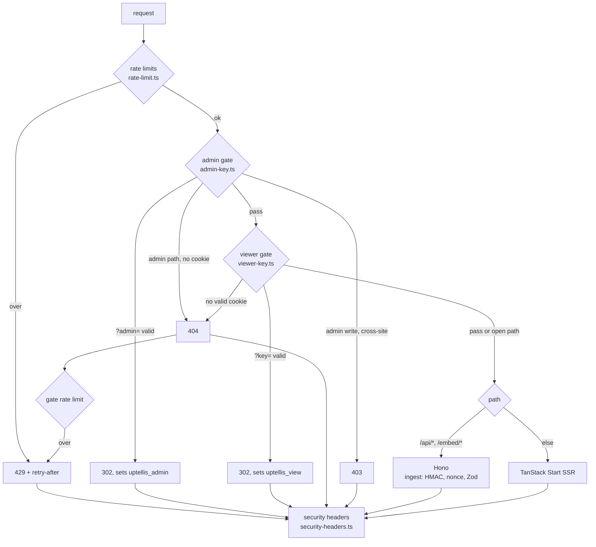

# Security

How Uptellis is protected, what is reachable without a key, and how to report a problem. Running it (deploys, secrets, rotation, incidents) is in [OPERATIONS.md](OPERATIONS.md).

## Threat model

A status page built on Uptellis can show the health of private infrastructure: host names, service names, replication state, versions, disk use. By default the dashboard is private, and nothing it shows may help an attacker reach the hosts behind it.

| Asset | Threat | Defence |
| --- | --- | --- |
| The dashboard and its API | Anyone on the internet reading it | Viewer key gate: 404 without a signed cookie |
| The site config, ingest keys | Changes by someone who is not an admin | Admin key gate, same-origin check on writes, admin write rate limit |
| The data (D1) | Forged or replayed producer posts | HMAC-SHA256 per key id, 120 s window, single-use nonces, key bound to one site and source |
| Private addresses, tokens, emails | Leaking through the page or the API | Collector and pusher map addresses to host names; the Worker rejects address literals in display fields; a whole-repo literal scan test |
| The keys themselves | Guessing, leaking through logs or referrers | 256-bit keys, gate rate limit, constant-time compare, `Referrer-Policy: no-referrer`, keys dropped from the URL by a redirect, invocation logs off |
| The Worker and D1 | Floods, oversized bodies | Per-client rate limits, 256 KB body cap before any hashing, retention pruning |
| Browsers of viewers | XSS, clickjacking, cross-site requests | CSP, `X-Frame-Options`, `frame-ancestors`, SameSite cookies, same-origin check |

Out of scope: an attacker with access to your Cloudflare account, your repository or its CI, or root on a producer host. Those can already change the Worker, its secrets or the data at the source.

## Request path

Every request runs through the same steps in `src/worker/serve.ts` (both runtimes). Assets under `/assets/*` and `/fonts/*` are served by Workers Static Assets and never reach the Worker (`run_worker_first` in `wrangler.jsonc`).

## Gates

Two key gates keep a deployment private without any other service in front of it. You can also put Cloudflare Access (or any other identity-aware proxy) in front of the pages; accounts with roles replace the keys in a later release ([roadmap.md](roadmap.md)).

- **Viewer gate** (`src/worker/middleware/viewer-key.ts`). With `VIEWER_KEY` set, pages and `/api/*` answer 404 without a valid `uptellis_view` or `uptellis_admin` cookie. A GET with `?key=<VIEWER_KEY>` sets the cookie and redirects to the same URL without the key. With `VIEWER_KEY` unset (local dev) everything is open.
- **Admin gate** (`src/worker/middleware/admin-key.ts`). `/admin`, `/admin/*` and `/api/admin/*` need a valid `uptellis_admin` cookie, set by a GET with `?admin=<ADMIN_KEY>` on any path. Production without `ADMIN_KEY` has no admin at all. Admin writes (anything but GET, HEAD, OPTIONS) must be same-origin: `Sec-Fetch-Site: same-origin`, or an `Origin` equal to the request's own; otherwise 403.
- 404 rather than 401 or 403, so the Worker does not advertise that something is there.

Keys are compared in constant time (both sides hashed, then compared). The ingest routes carry their own authentication and pass the viewer gate: see [Ingest](#ingest).

### Cookies

| Cookie | Set by | Value | Flags | Revoked by |
| --- | --- | --- | --- | --- |
| `uptellis_view` | `?key=<VIEWER_KEY>` | `<expiry>.<HMAC-SHA256 over v1.<expiry>>`, keyed with `VIEWER_COOKIE_SECRET` and `VIEWER_KEY` | `Max-Age` 30 days, `Path=/`, `HttpOnly`, `Secure`, `SameSite=Lax` | rotating `VIEWER_KEY` or `VIEWER_COOKIE_SECRET` |
| `uptellis_admin` | `?admin=<ADMIN_KEY>` | same construction, keyed with `VIEWER_COOKIE_SECRET`, an `admin` label and `ADMIN_KEY` | same | rotating `ADMIN_KEY` or `VIEWER_COOKIE_SECRET` |

The expiry is inside the signed value, so a cookie cannot be extended by editing it. `SameSite=Lax` rather than `Strict`: a `Strict` cookie is withheld on the redirect after following the admin link from another site, and admin would answer 404; cross-site writes are stopped by the same-origin check instead.

### What is public

Without any cookie, only these answer something other than 404:

- `GET /api/health`: `{ ok, service, version, build, commit }`. No config, no data, no hosts; the commit is the short hash of the deployed code.
- `POST /api/ingest/{kuma,facts,events}`: authenticated by HMAC (below); answers carry error codes, ids and counts, never payload values.

When the embed surface ships (`/embed/*`, `/api/public/*`), it joins this list only for sites with `public.enabled`, and only with allow-listed fields.

## Ingest

Producers sign each POST (`src/shared/signing.ts`): HMAC-SHA256 over `v1`, key id, timestamp, nonce, method, path and the SHA-256 of the body. The Worker (`src/worker/ingest/routes.ts`) checks, in order:

1. Body at most 256 KB: `Content-Length` first, then a capped read; nothing is hashed before this (413).
2. Headers, a timestamp within 120 s, a known key id and the signature (401). Keys stored in D1 are sealed with AES-GCM under a key derived from `SOURCE_MASTER_KEY`.
3. The key id's source may post to this route (403): each key id is bound to one site and one source, so a collector's key cannot post facts and a facts pusher's key cannot post a Kuma snapshot.
4. The nonce has not been seen in the last hour (409).
5. JSON (400) and the Zod schema, including the display-safety checks (422 with field paths only).

## Rate limits

Workers Rate Limiting bindings in `wrangler.jsonc`, applied by `src/worker/middleware/rate-limit.ts`. The counters are kept per Cloudflare location, so the limits are approximate: a brake on floods and key guessing, not a quota. Over the limit the Worker answers 429 with `retry-after: 60` (JSON on `/api/*`, plain text elsewhere).

| Binding | Counts | Key | Limit |
| --- | --- | --- | --- |
| `INGEST_RATE_LIMIT` (1001) | `POST /api/ingest/*`, before the HMAC check | claimed key id and client IP | 60 per minute |
| `GATE_RATE_LIMIT` (1002) | requests with `?key=` or `?admin=` (counted before the key is compared), and requests a gate answered 404 | client IP | 20 per minute |
| `ADMIN_WRITE_RATE_LIMIT` (1003) | non-GET requests to admin paths | client IP | 30 per minute |

The collector posts once a minute and backs off from 5 s after a failed send, the facts pusher every 15 minutes, so 60 per minute leaves room for a catch-up burst. Ingest is keyed by key id and IP together: a request that only names a producer's key id cannot use up that producer's budget from elsewhere. Page views and API reads with a valid cookie, and `/api/health`, are never counted.

## Response headers

`src/worker/middleware/security-headers.ts` sets these on every response the Worker sends (pages, API, redirects, 404s, 429s, errors), replacing any value an inner layer set:

| Header | Value |
| --- | --- |
| `Strict-Transport-Security` | `max-age=31536000; includeSubDomains` |
| `X-Content-Type-Options` | `nosniff` |
| `Referrer-Policy` | `no-referrer` |
| `Permissions-Policy` | accelerometer, camera, geolocation, gyroscope, magnetometer, microphone, payment and usb all off |
| `Cross-Origin-Opener-Policy` | `same-origin` |
| `X-Frame-Options` | `DENY`; `SAMEORIGIN` on `/` |
| `Content-Security-Policy` | `default-src 'self'; script-src 'self' 'unsafe-inline'; style-src 'self' 'unsafe-inline'; img-src 'self' data:; font-src 'self'; connect-src 'self'; object-src 'none'; base-uri 'none'; form-action 'self'; frame-ancestors 'none'` (`'self'` on `/`) |

`/` may be framed by this origin because the admin theme previews load `/?theme=<id>` in iframes. `script-src` allows inline scripts because TanStack Start streams its hydration data as inline `<script>` tags; a per-request nonce needs the router to be created with `ssr: { nonce }`. Pages, gate responses and every API route but `/api/health` are also `Cache-Control: no-store`.

## Logs and errors

- Error responses carry a code and a fixed message (`{ "error": "internal", "message": "Something went wrong" }`); pages show a fixed error screen. No stack traces, SQL or config values.
- Ingest, config and key logs are JSON lines with reason codes, ids and counts, and only the error name on failure: never a payload, key, cookie or request body. The collector and the facts pusher follow the same rule.
- Workers invocation logs are off (`observability.logs.invocation_logs: false`): they record each request's URL, and the login links carry the viewer and admin keys in their query string. The Worker's own console logs stay on.

## Data retention

The daily cron (`17 3 * * *`, `src/worker/cron.ts`) prunes:

| Table | Kept |
| --- | --- |
| `heartbeats` | 26 hours (folded into `heartbeat_5m` every 5 minutes) |
| `heartbeat_5m`, `fact_samples` | 90 days |
| `snapshots` (raw accepted payloads) | 7 days |
| `ingest_nonces` | until expiry, 1 hour after use |
| `incidents` | 1 year after they end; open incidents are kept |

Site configs, their revisions, sources and ingest keys are kept.

## Known limits

- The gates are key based: anyone holding a link has access until the key is rotated. Accounts with roles, sessions and API keys are planned ([roadmap.md](roadmap.md)); until then, an identity-aware proxy such as Cloudflare Access can front the pages.
- The login links contain the keys. They are exchanged for a cookie and dropped from the address bar at once, but they stay in the browser history of the first visit and wherever you share them. Share them only over private channels.
- The CSP allows inline scripts until the router passes a nonce.
- Rate limits are per location and approximate.

## Reporting a problem

Report a suspected vulnerability privately, as described in the security policy (`SECURITY.md` at the root of the repository). Do not open a public issue for it. If a key of your own deployment may have leaked, rotate it first ([OPERATIONS.md](OPERATIONS.md#secrets)).
