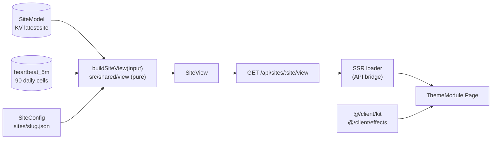
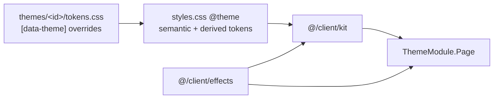

# Themes and the component kit

A theme is one page over one typed view-model. Data code builds `SiteView` once; themes only render it, so switching a site's theme never touches data code.



## Contract (frozen)

| File | What it fixes |
|---|---|
| `src/shared/view/types.ts` | `SiteView` and every piece a theme renders |
| `src/shared/view/input.ts` | `ViewInput` (`SiteModel`, 90-day history, config, now) |
| `src/client/kit/props.ts` | Prop types of every kit component and the effect hook signatures |
| `src/client/themes/types.ts` | `ThemeModule { id, label, dataTheme, Page }` |

Renaming or removing anything in these files breaks every theme, so it needs a major version. Adding an optional field is fine; say so in the changelog.

### Facts, highlights and topology

Themes never name a fact group or key: what the site's facts mean comes from its active profiles (see [profiles.md](profiles.md)). A theme reads three generic things:

- `factGroups`: every group with its `title`, `icon` (a kit icon name, or null), `level` and rows (label, display, level, percent), in the profiles' order.
- `highlights`: `{ label, row }` pairs the active profiles ask a theme to place in its summary (for example the collector's version and host). Empty when no active profile declares any; a theme shows its summary without them.
- `topology`: nodes, edges and the fence stamp, already refined by the profiles.

`factIndex` keeps every current fact by `group.key`, for tests and tools; themes do not look facts up by key.

## Rules for themes

- Import only `@/client/kit`, `@/client/effects`, `@/shared/view` types and the theme's own files. Never `@/client/lib/api`, worker, db or model code (a Biome rule enforces it).
- Style through the semantic tokens below, never raw colours in components. Each theme has one token file that overrides them under `[data-theme="<dataTheme>"]`.
- Stale data never keeps a green dot: render `ServiceView.state`, not `status`.
- `up` is always `#3ddc84`. The brand gradient is chrome only (banner, rules), never a status.
- No terminal transplants: no `[ ACCESS GRANTED ]` line, prompt lines, `user@host`, chevrons, fake commands, rotating tips or a prompt footer. Kept: banner, gradient, mono values, box-drawn panel titles with `exit 0` badges, beat bars, sparklines.
- Under `prefers-reduced-motion`: no canvas rain, no decrypt, glows become a 1px outline.
- Every string shown comes from `SiteView` (already display-safe). A theme audit test renders every fixture and fails on any address, email or token literal in the HTML.

## Semantic tokens (Tailwind v4 `@theme`)

`--color-base`, `--color-panel`, `--color-line`, `--color-ink`, `--color-muted`, `--color-accent`, `--color-up`, `--color-degraded`, `--color-down`, `--color-maint`, `--color-stale`, `--gradient-brand`, `--font-sans`, `--font-mono`. Kit classes: `bg-base`, `bg-panel`, `border-line`, `text-ink`, `text-muted`, `text-up`, and so on.

## Kit

Every component's props are in `src/client/kit/props.ts`. Import components from `@/client/kit` and hooks from `@/client/effects`. Components render the same markup on the server and the client: anything that ticks starts from the view's `now`, nothing is measured, and random or canvas work happens only after mount.

### Tokens the kit adds

Besides the semantic tokens above, `styles.css` defines derived tokens that follow the base set by default; a theme may pin them:

| Token | Default | Used for |
|---|---|---|
| `--color-faint` | muted mixed into base | third-level text, separators |
| `--color-raised` | panel lifted 3% toward ink | nested surfaces (cards, topology nodes, tooltips) |
| `--color-hair` | ink at 8% | hairlines, dashed row rules |
| `--color-frame` | `--color-accent` | the `[ ]` brackets around panel titles, decrypt noise |

Utilities: `text-gradient-brand`, `bg-gradient-brand`, `border-gradient-brand` (1px gradient border around a `--kit-fill` surface) and `bg-hatch` (diagonal hatch in the current colour). `Panel` reads three optional custom properties so a theme can nest panels: `--kit-in` (surface, default panel), `--kit-out` (what surrounds it, default base) and `--kit-line` (border, default line), e.g. `className="[--kit-in:var(--color-raised)] [--kit-out:var(--color-panel)]"` for a card inside a panel. They inherit, so set them on the panel that needs them.



### Components

```tsx
// Wordmark in ANSI Shadow block letters (A-Z, 0-9, space) with the brand gradient; decrypts once per session.
<Banner text="ACME" decrypt />

// Title set into the top border, right side aside and exit badge; `level="crit"` tints the border.
<Panel title="monitors" aside={`${view.summary.up}/${view.summary.total} up`} exitCode={section.exitCode}>...</Panel>

// Dot in the state colour; stale, paused and unknown are hollow; `pulse` only on live states.
<StateDot state={service.state} pulse />

// Theme C block header: title, the command as a muted tag, an aside and an exit badge (read as "exit 0" / "exit 1").
<BlockHeader title="Summary" command="status --summary" aside={<Age since={view.generatedAt} now={view.now} />} exitCode={0} />

<Verdict verdict={view.verdict} />
<FreshnessChip freshness={view.freshness} now={view.now} />
<StaleBanner freshness={view.freshness} now={view.now} generatedAt={view.generatedAt} />

// 90 cells, one tab stop; hover or arrow keys show the day; aria-label and copy payload are `beatsText`.
<BeatBar days={service.beats90d} text={service.beatsText} height={20} />

<Sparkline points={service.spark} level="ok" label="latency 371 to 410 ms" />
<Gauge value={view.summary.healthScore} cells={18} level="ok" label="health score" />
{view.topology && <TopologyTile topology={view.topology} />}
// Optional: per-node rows for the pair's cards, a corner caption, the line under the fence stamp.
<TopologyTile topology={topo} caption="app failover pair" rows={{ "app-1": [{ label: "app", value: "serving", state: "up" }, { label: "disk", value: "16%", percent: 16, level: "ok" }] }} fenceDetail="tl 1/1 · peer is a standby · 23:58" />
<ActivityFeed items={view.activity} now={view.now} limit={12} columns={2} />
// Optional: recent checks after the events (`limit` counts both), e.g. from each ServiceView.recent.
<ActivityFeed items={events} checks={[{ id: s.id, service: s.name, beat: s.recent[0] }]} now={view.now} limit={12} columns={2} />
{view.incidents.open.map((i) => <IncidentRail key={i.id} incident={i} now={view.now} />)}
<FactList rows={group.rows} />
<KeyValueGrid columns={3} items={[{ icon: "grid", label: "monitors", value: `${view.summary.total} total` }]} />
<Icon name="database" size={14} className="text-muted" />
<EmptyState title="No monitors yet" detail="No source has reported." />
<Footer generatedAt={view.generatedAt} collectorHost="watch-1" commit={commit} hints={[{ keys: "j k", label: "cards" }]} />
<Age since={incident.startedAt} now={view.now} suffix={false} />

// Not in props.ts: renders children only after hydration (for canvases and anything measured).
<ClientOnly fallback={null}>{children}</ClientOnly>
```

### Effects

```tsx
const reduced = useReducedMotion();          // false on the server
const visible = useVisibilityPause();        // false while the tab is hidden
const first = useSessionOnce("intro");       // true once per browser session, after mount
const title = useDecrypt("[ Services Status ]", { durationMs: 1100 }); // text itself when skipped
const ageS = useAgeTicker(since, view.now);  // server value, then ticks while visible
const glow = useStateChangeGlow(service.state); // true for 1.5 s after a change, never on mount

// Katakana rain: tail colour is the canvas's `color`, the head uses --color-ink; 12 fps, paused when hidden.
const rain = useRef<HTMLCanvasElement>(null);
useMatrixRain(rain, { fps: 12 });
return <canvas ref={rain} aria-hidden className="pointer-events-none absolute inset-0 size-full text-frame opacity-10" />;
```

Under reduced motion `useDecrypt` returns the text, `useMatrixRain` draws nothing, the state dot ping and the topology edge flow stop (`motion-safe:`), and themes should turn `useStateChangeGlow` into a 1px outline with `motion-reduce:`.
