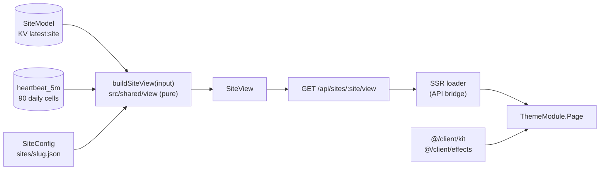
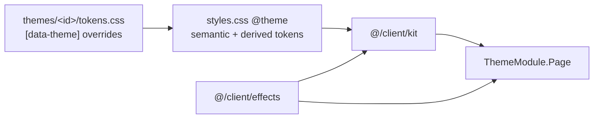

# Themes and the component kit

A theme is one page over one typed view-model. Data code builds `SiteView` once; themes only render it, so switching a site's theme never touches data code.

Nine themes ship: `a-sys-status`, `b-control-room` and `c-session` (terminal-styled, dark), and `d-classic`, `e-editorial`, `f-dashboard`, `g-wallboard`, `h-friendly` and `i-minimal` (Phase 7; their mock-ups and the build contract are in [contracts/phase-7b.md](contracts/phase-7b.md)). Every registered theme must pass the conformance tests (`tests/unit/theme-anchors.test.ts`, `theme-maintenance.test.ts`, `theme-profiles.test.ts`) and must not use `text-base` as a size: in this project it is the page background colour.



## Contract (frozen)

| File | What it fixes |
|---|---|
| `src/shared/view/types.ts` | `SiteView` and every piece a theme renders |
| `src/shared/view/input.ts` | `ViewInput` (`SiteModel`, 90-day history, config, now) |
| `src/client/kit/props.ts` | Prop types of every kit component and the effect hook signatures |
| `src/client/themes/types.ts` | `ThemeModule { id, label, dataTheme, Page }` |

Renaming or removing anything in these files breaks every theme, so it needs a major version. Adding an optional field is fine; say so in the changelog.

### Facts, highlights and topology

Themes never name a fact group or key: what the site's facts mean comes from its active profiles (see [profiles.md](profiles.md)). A theme reads these generic parts of the view:

- `factGroups`: every group with its `title`, `icon` (a kit icon name, or null), `summary` (one line for a compact row, or null), `summaryParts`, `level` and rows (label, display, level, percent), in the profiles' order.
- `summaryParts` (contract addition): the summary line as `{ text, level, emphasis }` parts, always present (empty without a summary; one plain part when the profile gives only a string). Render them in order with a space between: `ok`, `warn` and `crit` in their state colours, `info` as secondary text, a null level as plain text, `emphasis` in bold. For example `16.0.5` (plain), `·` (info), `HTTP 200` (ok), `·` (info), `serving app-1` (info).
- `highlights`: `{ label, row, note }` entries (`note` is an optional badge such as "latest" with a level) the active profiles ask a theme to place in its summary (for example the collector's version and host). Empty when no active profile declares any; a theme shows its summary without them.
- `slot` on a highlight (contract addition): its place in the summary, and the order of `highlights` (lowest first, those without a slot after them in profile order). A theme that mixes highlights among its own figures gives each figure its slot from `SUMMARY_SLOTS` (`@/shared/view`: monitors 10, avg response 20, health 40, uptime 24h 50, uptime 30d 60, snapshot 80) and sorts them all by slot; `highlightSlots` carries the first highlight's `slot` on each group.
- `prefix` on a highlight (contract addition): a short word before its value, e.g. "db" for the Kuma slot's "db 41.2 MB"; `highlightSlots` gives each row's text with its prefix in `texts`.
- `headline`: one sentence about the system (for example "Forgejo serving from app-1, replication streaming"), or null.
- `topology`: nodes (with `details`, the rows of a node's card), edges and the fence stamp, already refined by the profiles. The fence's `detail` (contract addition) is a short stamp line from the profile, e.g. "tl 1/1", or null. `edgeState(edge, topology.nodes)` (`@/shared/view`) says what a theme may claim about an edge: `live` while it flows, `stopped` when a profile gave it a detail or an end node is `down` or `degraded`, else `unknown` (nothing reports on it, e.g. no facts yet or a retired facts source), which a theme draws muted as "no data" and never counts as a failure (no red, no `exit 1`).

`factIndex` keeps every current fact by `group.key`, for tests and tools; themes do not look facts up by key.

### Sections

`sections` holds the config's sections in config order, each with the services the model has, in the section's order (unknown ids are skipped). A section none of whose services is in the model (all its ids unknown, or none listed) is left out (contract addition, 0.5.0), so every entry has at least one service and no theme renders an empty header such as "Database UNKNOWN" with nothing under it. `unsectioned` is unchanged: the model's services no section lists. Data of a source the site no longer lists (a retired collector, facts pusher or webhook) is left out of the whole view: its services, their beats and incidents, and its facts with the fact groups, highlights, headline and topology built from them; the history stays stored.

### Verdict

`verdict.state` is one of `operational`, `degraded`, `outage`, `maintenance`, `stale` and `empty`, and `verdict.label` is its short text. `maintenance` is a contract addition (0.5.0): the verdict is `maintenance` when no service is down or degraded, at least one is in a maintenance window and none is up, for example while a site-wide window covers every service (label "8 services under maintenance"). The order is `empty`, `outage`, `stale` (dropped while a window covers the whole site), `degraded`, `maintenance`, `operational`. Partial maintenance (some services up, the rest in a window, none down) stays `operational`, and the theme shows the window as its maintenance notice. A theme maps every state (a `Record<VerdictState, ...>` makes the compiler check it), colours `maintenance` with the `maint` token (`text-maint`, `bg-maint`, or a darker theme-private shade of it where text sits on it) and never claims services are up while the verdict is `maintenance`: its summary lines say how many services are in maintenance instead. The `maintenance` fixture (`/_preview?fixture=maintenance`, also in `bun run a11y`) renders this case, and `tests/unit/theme-maintenance.test.ts` checks it in every registered theme.

### Registry: theme-color and fonts

Each theme is registered in `src/client/themes/index.ts` as a `RegisteredTheme`:

| Field | What it is |
|---|---|
| `module` | the theme's `ThemeModule` |
| `themeColor` | `<meta name="theme-color">`, the theme's `--color-base` (the folder's `THEME_COLOR`) |
| `themeColorDark` | optional: the dark `--color-base` of a theme that follows `prefers-color-scheme` (`f-dashboard`, `i-minimal`; the folder's `THEME_COLOR_DARK`) |
| `fonts` | the font files the page preloads: `KIT_FONTS` (Geist and JetBrains Mono) for A, B and C, the folder's `FONTS` (its own self-hosted `@font-face` files, empty for a system stack) for the others |

The root document (`src/client/routes/__root.tsx`) renders the shown theme's head tags from `themeHead()`: one `theme-color`, or two with `media="(prefers-color-scheme: light)"` and `media="(prefers-color-scheme: dark)"` when `themeColorDark` is set, and a preload for each of its `fonts` only. They follow a `?theme=` preview. They are not route `meta`, because the router keeps one meta per `name`. `tests/support/registered-themes.ts` mirrors these fields for the SSR tests, and `tests/unit/client-preview.test.ts` keeps it in sync.

## Rules for themes

- Import only `@/client/kit`, `@/client/effects`, `@/shared/view` types and the theme's own files. Never `@/client/lib/api`, worker, db or model code (a Biome rule enforces it).
- Style through the semantic tokens below, never raw colours in components. Each theme has one token file that overrides them under `[data-theme="<dataTheme>"]`.
- Stale data never keeps a green dot: render `ServiceView.state`, not `status`.
- `up` is `#3ddc84` on the dark themes (A, B, C, wallboard); the light themes use a darker green of their own so that text and icons in `up` stay readable on white (contrast AA). The brand gradient is chrome only (banner, rules), never a status.
- No terminal transplants: no `[ ACCESS GRANTED ]` line, prompt lines, `user@host`, chevrons, fake commands, rotating tips or a prompt footer. Kept: banner, gradient, mono values, box-drawn panel titles with `exit 0` badges, beat bars, sparklines.
- Under `prefers-reduced-motion`: no canvas rain, no decrypt, glows become a 1px outline.
- Every string shown comes from `SiteView` (already display-safe). A theme audit test renders every fixture and fails on any address, email or token literal in the HTML.

## Semantic tokens (Tailwind v4 `@theme`)

`--color-base`, `--color-panel`, `--color-line`, `--color-ink`, `--color-muted`, `--color-accent`, `--color-up`, `--color-degraded`, `--color-down`, `--color-maint`, `--color-stale`, `--gradient-brand`, `--font-sans`, `--font-mono`. Kit classes: `bg-base`, `bg-panel`, `border-line`, `text-ink`, `text-muted`, `text-up`, and so on.

## Kit

Every component's props are in `src/client/kit/props.ts`. Import components from `@/client/kit` and hooks from `@/client/effects`. Components render the same markup on the server and the client: anything that ticks starts from the view's `now`, nothing is measured, and random or canvas work happens only after mount.

### Tokens the kit adds

Besides the semantic tokens above, `styles.css` defines derived tokens that follow the base set by default; a theme may pin them:

| Token | Default | Used for |
|---|---|---|
| `--color-faint` | muted mixed into base | third-level text, separators |
| `--color-raised` | panel lifted 3% toward ink | nested surfaces (cards, topology nodes, tooltips) |
| `--color-hair` | ink at 8% | hairlines, dashed row rules |
| `--color-frame` | `--color-accent` | the `[ ]` brackets around panel titles, decrypt noise |

Utilities: `text-gradient-brand`, `bg-gradient-brand`, `border-gradient-brand` (1px gradient border around a `--kit-fill` surface) and `bg-hatch` (diagonal hatch in the current colour). `Panel` reads three optional custom properties so a theme can nest panels: `--kit-in` (surface, default panel), `--kit-out` (what surrounds it, default base) and `--kit-line` (border, default line), e.g. `className="[--kit-in:var(--color-raised)] [--kit-out:var(--color-panel)]"` for a card inside a panel. They inherit, so set them on the panel that needs them.



### Components

```tsx
// Wordmark in ANSI Shadow block letters (A-Z, 0-9, space) with the brand gradient; decrypts once per session.
<Banner text="ACME" decrypt />

// Title set into the top border, right side aside and exit badge; `level="crit"` tints the border.
<Panel title="monitors" aside={`${view.summary.up}/${view.summary.total} up`} exitCode={section.exitCode}>...</Panel>

// Dot in the state colour; stale, paused and unknown are hollow; `pulse` only on live states.
<StateDot state={service.state} pulse />

// Theme C block header: title, the command as a muted tag, an aside and an exit badge (read as "exit 0" / "exit 1").
<BlockHeader title="Summary" command="status --summary" aside={<Age since={view.generatedAt} now={view.now} />} exitCode={0} />

<Verdict verdict={view.verdict} />
<FreshnessChip freshness={view.freshness} now={view.now} />
<StaleBanner freshness={view.freshness} now={view.now} generatedAt={view.generatedAt} />

// 90 cells, one tab stop; hover or arrow keys show the day; aria-label and copy payload are `beatsText`.
<BeatBar days={service.beats90d} text={service.beatsText} height={20} />

<Sparkline points={service.spark} level="ok" label="latency 371 to 410 ms" />
<Gauge value={view.summary.healthScore} cells={18} level="ok" label="health score" />
{view.topology && <TopologyTile topology={view.topology} />}
// Optional: per-node rows for the pair's cards, a corner caption, the line under the fence stamp.
<TopologyTile topology={topo} caption="app failover pair" rows={{ "app-1": [{ label: "app", value: "serving", state: "up" }, { label: "disk", value: "16%", percent: 16, level: "ok" }] }} fenceDetail="tl 1/1 · peer is a standby · 23:58" />
<ActivityFeed items={view.activity} now={view.now} limit={12} columns={2} />
// Optional: recent checks after the events (`limit` counts both), e.g. from each ServiceView.recent.
<ActivityFeed items={events} checks={[{ id: s.id, service: s.name, beat: s.recent[0] }]} now={view.now} limit={12} columns={2} />
{view.incidents.open.map((i) => <IncidentRail key={i.id} incident={i} now={view.now} />)}
<FactList rows={group.rows} />
// A group's summary line, coloured part by part (contract addition); `stale` drops the state colours.
<SummaryParts parts={group.summaryParts} stale={!group.fresh} />
<KeyValueGrid columns={3} items={[{ icon: "grid", label: "monitors", value: `${view.summary.total} total` }]} />
<Icon name="database" size={14} className="text-muted" />
<EmptyState title="No monitors yet" detail="No source has reported." />
<Footer generatedAt={view.generatedAt} collectorHost="watch-1" commit={commit} hints={[{ keys: "j k", label: "cards" }]} />
<Age since={incident.startedAt} now={view.now} suffix={false} />

// Not in props.ts: renders children only after hydration (for canvases and anything measured).
<ClientOnly fallback={null}>{children}</ClientOnly>
```

### Effects

```tsx
const reduced = useReducedMotion();          // false on the server
const visible = useVisibilityPause();        // false while the tab is hidden
const first = useSessionOnce("intro");       // true once per browser session, after mount
const title = useDecrypt("[ Services Status ]", { durationMs: 1100 }); // text itself when skipped
const ageS = useAgeTicker(since, view.now);  // server value, then ticks while visible
const glow = useStateChangeGlow(service.state); // true for 1.5 s after a change, never on mount

// Katakana rain: tail colour is the canvas's `color`, the head uses --color-ink; 12 fps, paused when hidden.
const rain = useRef<HTMLCanvasElement>(null);
useMatrixRain(rain, { fps: 12 });
return <canvas ref={rain} aria-hidden className="pointer-events-none absolute inset-0 size-full text-frame opacity-10" />;
```

Under reduced motion `useDecrypt` returns the text, `useMatrixRain` draws nothing, the state dot ping and the topology edge flow stop (`motion-safe:`), and themes should turn `useStateChangeGlow` into a 1px outline with `motion-reduce:`.

## Accessibility

`bun run a11y` audits every registered theme with [axe-core](https://github.com/dequelabs/axe-core) in headless Chromium: each theme on the `default`, `stale`, `incident` and `maintenance` fixtures (`/_preview`), at 1440x900 and 390x844, in light and dark (emulated `prefers-color-scheme`). It checks the WCAG 2.0, 2.1 and 2.2 A and AA rules, colour contrast included, plus axe's best-practice rules (landmarks, heading order), prints the findings grouped by theme and rule, and exits 1 on any serious or critical one. It is not part of `verify`, because it needs a browser and the dev server.

```sh
bun run a11y --out a11y-report.json            # uses vite dev on :5173, or starts one on a free port
bun run a11y --url http://localhost:5391 --theme d-classic,i-minimal --fixture incident
CHROME_PATH=/usr/bin/google-chrome bun run a11y  # another Chromium than playwright-core's own revision
```

The browser is driven by `playwright-core` (the driver only, no browser download): it launches the Chromium of its revision from `~/.cache/ms-playwright` (`bunx playwright-core install chromium-headless-shell` fetches it) unless `CHROME_PATH` is set. The JSON report holds every finding with its element and the variants it fails in, the exclusions that matched, and axe's "needs review" counts (text over a gradient or a pseudo element, whose contrast axe cannot compute; these do not fail the run, so check them by hand when a theme changes such a surface).

Fix a finding in the theme's tokens or components: `--color-muted`, and `--color-faint` wherever a theme sets text in it, must keep 4.5:1 on `base`, `panel` and `raised`. When a finding is a false positive or intended (decorative text, say), add a narrow entry to `EXCLUSIONS` in `scripts/a11y-audit.ts`: one rule, one theme, a target selector pattern and the reason. Never switch a rule off.
