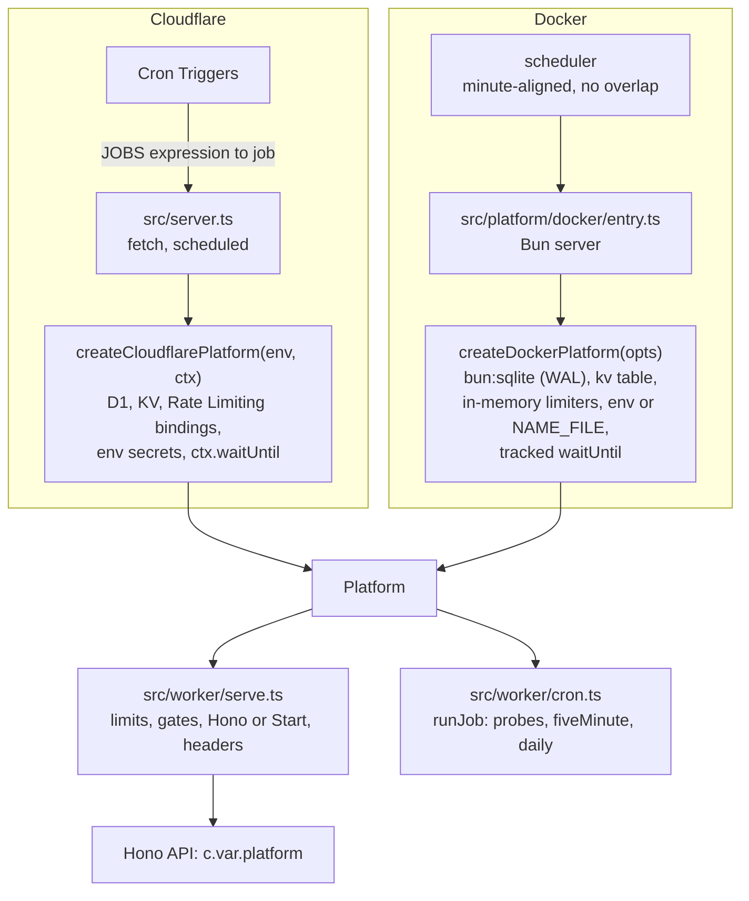
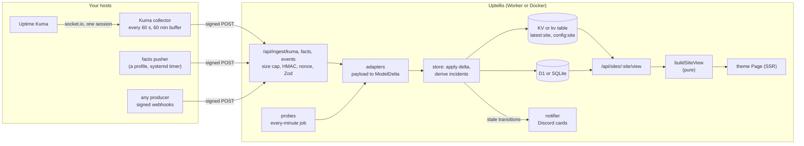
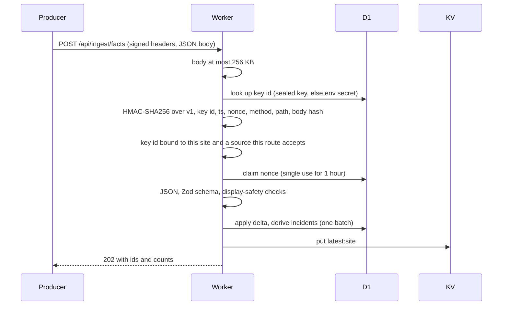
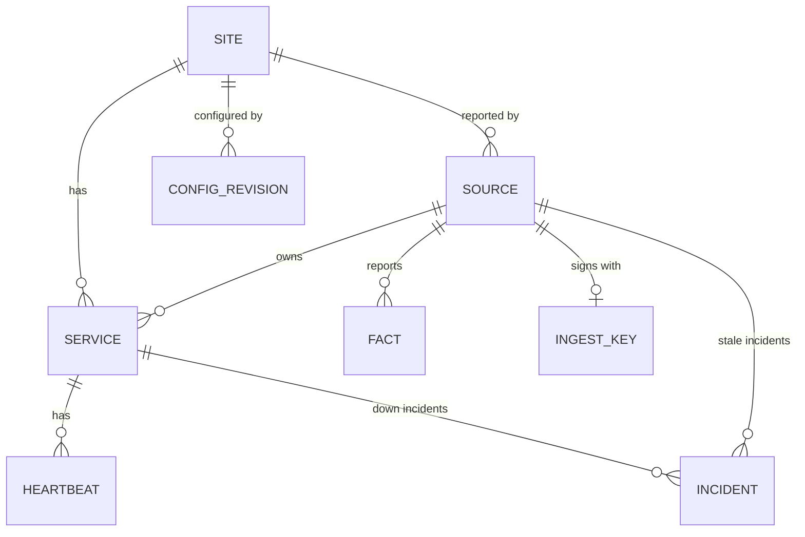
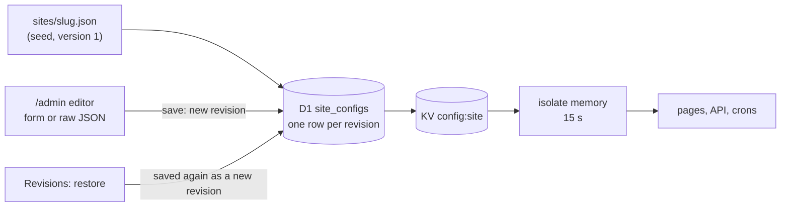
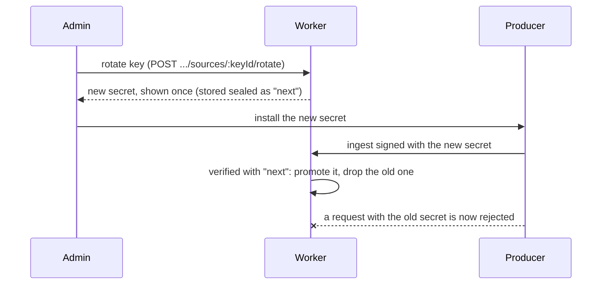
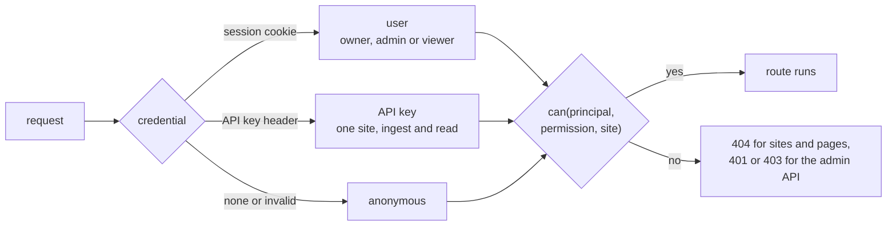

# Architecture

Uptellis ("uptime, tell us") is a self-hostable status page and monitor. Producers you run next to your systems, and checks the Worker runs itself, report into one normalized model; a pure function turns that model into a view; swappable themes render the view. This page describes how the pieces fit together today. Running it is in [OPERATIONS.md](OPERATIONS.md), the security model in [SECURITY.md](SECURITY.md), themes and the component kit in [THEMES.md](THEMES.md), and what comes next in [roadmap.md](roadmap.md).

## Runtime

One app, two runtimes. On **Cloudflare** a single Worker (`src/server.ts`) serves everything, with D1, KV, Workers Static Assets, Rate Limiting and Cron Triggers. In **Docker** a single Bun process (`src/platform/docker/entry.ts`) serves the same app over one SQLite file and runs the jobs itself. Everything between the two entry points is shared:

- **Hono** owns `/api/*` and `/embed/*` (`src/worker/index.ts`): ingest, the read API, the admin API, accounts (Better Auth at `/api/auth/*`, setup, invites) and `/api/health`.
- **TanStack Start** (React 19) server-renders every other path: the status page, `/admin`, the account pages (`/setup`, `/sign-in`, `/invite/<token>`, `/account`) and, under `vite dev` only, `/_preview`.
- SSR loaders call the Hono app **in-process** through an API bridge (`src/client/lib/api.ts`): same app, same platform, no network hop.
- The **SQL database** (D1 or SQLite, through Drizzle, `src/worker/db/schema`, migrations in `migrations/`) is the source of truth. A **key-value cache** (KV, or the SQLite `kv` table) holds the assembled model (`latest:<site>`) and the current config (`config:<site>`).
- **Zod 4** schemas in `src/shared` validate every payload, config and API body, in the app and in the producers.
- Static assets (client bundle, fonts) are served by Workers Static Assets on Cloudflare and by the Bun server in Docker, before the app.
- Three scheduled jobs (see [Crons](#crons)): Cron Triggers on Cloudflare, the built-in scheduler in Docker.

The rest of this page names the Cloudflare pieces (the Worker, D1, KV); in Docker read the Bun server, SQLite and the `kv` table.

## Platform layer

Everything the app needs from where it runs is one interface, `Platform` in `src/platform/types.ts`: the database (`db`, and `batch` for atomic multi-statement writes), the key-value cache (`kv`), the rate limiters (`rateLimiter`, budgets in `RATE_LIMITERS`), secrets and settings by name (`secret`, `setting`), `waitUntil` for work that outlives a response, and the clock. Only the adapters in `src/platform/<runtime>/` and the two entry points touch bindings, env vars or files; stores, jobs, routes and middleware receive a `Platform`.

- **Requests.** Each entry point builds `AppBindings` (the platform and the runtime's `INGEST_KEY_*` secrets) and hands the request to `handleRequest` in `src/worker/serve.ts`, which passes the bindings to `app.fetch`; `platformContext` puts them on the Hono context, so every handler reads `c.var.platform`.
- **Batches.** There are no interactive transactions anywhere: several rows are written as a unit with `platform.batch`, a D1 batch on Cloudflare and one SQLite transaction in Docker. Queries are built once with Drizzle and run on either driver; code that needs a write's row count reads it with `changesOf` (`src/worker/db/util.ts`), which understands both drivers' results.
- **Jobs.** `JOBS` names the three jobs and their cron expressions. On Cloudflare the `scheduled` handler (`src/platform/cloudflare/scheduled.ts`) maps each Cron Trigger to its job, so the triggers in `wrangler.jsonc` must be exactly the `JOBS` expressions. In Docker the scheduler (`src/platform/docker/scheduler.ts`) wakes at every UTC minute and starts the due jobs. Both run `runScheduledJob` (`src/worker/scheduled.ts`).
- **Migrations.** One `migrations/` folder serves both: wrangler applies it to D1 on deploy, the Docker server applies it to SQLite at startup (Drizzle's migrator).
- **Builds.** `vite build` produces the Worker (`dist/`); `vite build --mode docker` (`bun run build:docker`) produces the Bun server (`dist-docker/`: client files and one server bundle with every dependency inside, so the image needs no `node_modules`). `vite dev` runs the Cloudflare build under workerd.

## Data flow

Every producer reports as one **source**. There are four source kinds, each with its own ingest route and adapter (`src/worker/adapters`):

| Kind | Producer | Route | What it carries |
| --- | --- | --- | --- |
| `kuma` | the Kuma collector (`collector/`), a Bun service next to Uptime Kuma | `POST /api/ingest/kuma` | a `KumaSnapshot`: monitors, their heartbeats since the last send, uptime, certificates, Kuma metadata as facts |
| `facts` | a facts pusher, usually a shell script on a timer (see [profiles](../profiles/forgejo-ha/README.md)) | `POST /api/ingest/facts` | a `FactsPayload`: typed facts in named groups |
| `webhook` | anything that can sign a request | `POST /api/ingest/events` | an `EventsPayload`: services it declares, their heartbeats, optional facts |
| `probe` | the Worker itself (source `probe:cf`) | none: the every-minute cron | one heartbeat per configured HTTP check |

A signed request goes through the checks in [SECURITY.md](SECURITY.md#ingest) (body size, signature, key binding, nonce, schema). The adapter turns the payload into a `ModelDelta`; the store writes it to D1 in one batch, derives incidents, assembles the site model and puts it in KV. The probe cron builds the same kind of delta and goes through the same path (`applyIngestDelta` in `src/worker/engine/ingest-service.ts`), so probe results move heartbeats, incidents and freshness exactly as a Kuma snapshot does.

Two details keep the history exact:

- A delta whose `generatedAt` is older than its source's last accepted one is **history only**: its heartbeats are stored (idempotently, never opening or closing incidents), but services, facts and `latest:<site>` are left alone. The collector's 60 minute buffer and Kuma resending its last 100 beats per monitor on reconnect fill short gaps this way.
- Every accepted payload is also kept raw for 7 days (`snapshots`) for debugging.

### Signed ingest

The signature scheme lives in `src/shared/signing.ts`, shared by the Worker (verify) and the collector (sign); the facts pusher implements the same canonical string in shell. Details and status codes: [SECURITY.md](SECURITY.md#ingest).

## Model

The model is defined in `src/shared/model` and stored in D1.

- **Site.** A slug (the key of every row), a name and the hostnames it answers on. Each site has a config (below). The demo site is `demo`, "Acme Cloud", at `status.example.com`.
- **Source.** One producer, id `<kind>:<name>` (for example `kuma:watch-1`, `facts:app-1`, `probe:cf`), with an expected interval from the config and the time it was last seen. Its **freshness** at any moment is `fresh` below 2 times the expected interval, `aging` up to 5 times, `stale` beyond, and `empty` when it has never reported (`sourceFreshness` in `src/shared/model/source.ts`).
- **Service.** A monitored thing, id `<source kind>:<externalId>` (`kuma:3`, `probe:api`): a Kuma monitor, a probe or a service a webhook declares. It has a kind (`http`, `port`, `ping`, `keyword`, `push`, `fact`), a status (`up`, `down`, `degraded`, `pending`, `maintenance`, `paused`, `unknown`), latency, uptime ratios, an optional certificate summary and a display target (host and path, never an address).
- **Heartbeat.** One check result of a service: time, status, latency, a short message. Raw heartbeats are kept 26 hours and folded into 5-minute buckets (`heartbeat_5m`, kept 90 days) that feed the 90-day beat bars.
- **Incident.** Derived, never typed in (`src/worker/engine/incidents.ts`). A `down` incident belongs to a service: a `down` beat opens one, `up` or `degraded` closes it; `pending`, `maintenance`, `paused` and `unknown` do neither, so maintenance is never downtime. A `stale` incident belongs to a source: the 5-minute sweep opens it when the source turns `stale` and closes it when the source is `fresh` or `aging` again (an ingest from the silent source closes it at once). Ids are `<subject>:<startedAt>`, so derivation is idempotent.
- **Fact.** A typed value (`number`, `string`, `boolean`, `timestamp`) in a group, with an optional unit and severity (`ok`, `warn`, `crit`, `info`), an observation time and how long it stays current (`freshForS`). Facts carry the state that is not a heartbeat: replication lag, the last backup, disk use. Samples are kept 90 days (`fact_samples`).

Every string the model stores is **display-safe**: the schemas reject address literals, emails and token-like strings in display fields (`src/shared/model/safety.ts`), and producers map addresses to host names before they send.

## From model to page

`buildSiteView` (`src/shared/view/build.ts`) is the one pure function from stored data to what a theme renders: the site model, 90 days of `heartbeat_5m` cells, the site config and `now` go in, a `SiteView` comes out. No I/O, no clock reads, deterministic.

- A service whose source is `stale` or `empty` shows as `stale`, never with its last status, so stale data never keeps a green dot.
- The **verdict** is, in order of precedence: `empty` (nothing has reported), `outage` (a service is down on current data), `stale` (a source is stale), `degraded`, `operational`. Stale services never count as down, so stale data cannot fake an outage.
- Each service gets a health score from the config's weights (uptime, latency, certificate), 90 daily beat cells, recent checks and a sparkline; facts are grouped, labelled and levelled against the config's thresholds; the topology, activity feed and incidents are laid out for rendering.

`GET /api/sites/:site/view` returns this view; the page's SSR loader fetches it through the API bridge and hands it to the site's theme. The page refreshes its data every 30 seconds while the tab is visible and ticks ages every second.

## Themes and the kit

A theme is one React page over `SiteView`. Three are registered (`src/client/themes/index.ts`): `a-sys-status`, `b-control-room` and `c-session`. The site config picks one; `/?theme=<id>` previews another without saving. Themes import only the component kit (`@/client/kit`), the effect hooks (`@/client/effects`) and the view types, and style through semantic tokens, so switching a theme never touches data code. All themes share the command palette (`/` or Ctrl/Cmd+K) and the keyboard map (`?`). The contract and the kit are documented in [THEMES.md](THEMES.md).

## Site config and revisions

A site's config (`SiteConfig`, `src/shared/config/site.ts`) holds its name, hostnames, theme, sources and their expected intervals, probes, sections (which services appear under which title), display names, host aliases, an optional topology (nodes and replication, watches, depends or network edges), health weights, fact thresholds, links, branding, the public allow-list and notification switches.

- The committed `sites/<slug>.json` seeds version 1 of a site on first read. From then on D1 is the source of truth: every save is a new row, nothing is overwritten or deleted, and a restore saves an old version again as a new revision.
- Saves use optimistic concurrency (`baseVersion`): a save against a stale version answers 409.
- Reads go isolate memory (15 s), then KV, then D1, so a save shows everywhere within about 15 seconds.
- Export produces `sites/<slug>.json` byte for byte (keys in schema order, defaults applied), and import takes the same format with a dry run that shows the diff.

## Admin

`/admin` has five tabs: **Config** (form or raw JSON, validated, with a diff before saving), **Revisions** (history with restore), **Import and export**, **Sources** (ingest sources and their keys) and **Themes** (side-by-side previews). The admin API is typed in `src/shared/schemas/admin.ts` (and `src/shared/schemas/auth.ts` for users, invites and API keys) and mounted at `/api/admin`; each route needs a permission of the signed-in user ([Accounts and access](#accounts-and-access)):

| Route | What it does |
| --- | --- |
| `GET`, `PUT /sites/:site/config` | read the current config, save a new revision |
| `GET /sites/:site/config/export`, `POST .../import` | export, import (with a dry run) |
| `GET .../revisions`, `POST .../revisions/:version/restore` | list revisions, restore one |
| `GET`, `POST /sites/:site/sources` | list sources and keys, add a source with a new key |
| `POST /sites/:site/sources/:keyId/rotate` | issue a new secret for a key |
| `GET`, `POST /sites/:site/api-keys`, `DELETE .../api-keys/:id` | list, create (secret shown once) and revoke API keys |
| `GET /users`, `PATCH`, `DELETE /users/:id` | list users, change a role, remove a user |
| `GET`, `POST /invites`, `DELETE /invites/:id` | list, create (one-time link) and delete invites |
| `POST /notify/test?kind=stale\|recovered` | send a test notification card |

Ingest keys created in admin are stored in D1 sealed with AES-256-GCM under a key derived (HKDF-SHA256) from the `SOURCE_MASTER_KEY` secret; a secret is shown exactly once. Rotation keeps the old secret working until the producer's first request signed with the new one, which promotes it:

Keys can also come from Worker secrets named `INGEST_KEY_<ID>` (bound to a site and source in `src/worker/ingest/keys.ts`); the first rotation of such a key moves it into D1.

## Notifications

When `DISCORD_WEBHOOK_URL` is set, the notifier (`src/worker/notify`) posts exactly one Discord card when a `stale` incident opens (a source went silent) and one when it resolves (it is back, with how many heartbeats were backfilled for the gap). Service `down` incidents do not post: the monitor that watches the service (Uptime Kuma, for example) already alerts on those.

- Both places that see stale transitions hand them to the notifier: the 5-minute sweep and an ingest that brings a silent source back.
- Each transition is claimed in the D1 `notifications` table before its card is sent, so it goes out at most once, however often a cron retries.
- Cards never ping anyone, carry only source ids, host names and times, and are checked for addresses, emails and tokens before sending. A send times out after 5 seconds; a 429 is retried once. Failures are recorded, never thrown into the cron or the ingest.
- `POST /api/admin/notify/test` sends a card labelled TEST built from the current state.

## Crons

`JOBS` in `src/platform/types.ts` names three jobs and their cron expressions (UTC); `runJob` in `src/worker/cron.ts` performs them. Cloudflare runs them from Cron Triggers (the triggers in `wrangler.jsonc` are exactly these expressions), Docker from its own scheduler ([Platform layer](#platform-layer)).

| Job | Expression | What it does |
| --- | --- | --- |
| `probes` | `* * * * *` | Probes: every probe due this minute runs (at most 6 at a time), results go through the ingest path as source `probe:cf` |
| `fiveMinute` | `*/5 * * * *` | Fold the last 2 hours of heartbeats into `heartbeat_5m`; sync configured sources; sweep source staleness, open and close `stale` incidents, post their cards, refresh `latest:<site>` when anything changed |
| `daily` | `17 3 * * *` | Prune rows past retention (see [SECURITY.md](SECURITY.md#data-retention)) and expired `kv` entries |

Probes check public `https` URLs only (no address literals, credentials or private-only names), never follow redirects, never read the body, and retry a failure once after 2 seconds before counting it as `down`.

## Accounts and access

Every request passes the same steps in `src/worker/serve.ts`, on both runtimes: rate limits, then Hono or the page gate and TanStack Start, and every response leaves with the security headers.

- **Principal.** Hono resolves who is asking for every `/api/*` request (`src/worker/auth`): a Better Auth session cookie, an API key (`Authorization: Bearer`), or anonymous. `can()` in `src/shared/auth.ts` decides from the role (`owner`, `admin`, `viewer`) or the key's site and scopes.
- **Sites.** A public site's page and read API are open; a private one answers 404 to anyone without `page.view`, exactly like an unknown site. Page loaders call the API through the bridge as the page's principal.
- **Admin.** Each admin route needs its permission (401 signed out, 403 without it); writes must be same-origin. `/admin` pages send a signed-out visitor to `/sign-in`.
- **Accounts.** The first account is the owner (`/api/setup`, closed afterwards); everyone else joins through a one-time invite that carries the role. The last owner can never be demoted or removed.
- **Always open.** `GET /api/health`, ingest (HMAC-signed or an API key with the `ingest` scope), Better Auth, `/api/me`, setup and invites.
- **Rate limits** on ingest, sign-in attempts, refusals and admin writes; a 256 KB body cap before any hashing; CSP and the usual headers on everything.

The full model, with the roles, invites, session cookies, API keys, JWTs, the ingest checks, the limits and the headers, is in [SECURITY.md](SECURITY.md).

## Source layout

| Path | What lives there |
| --- | --- |
| `src/server.ts` | the Cloudflare Worker entry: `fetch` and `scheduled` |
| `src/platform/` | the `Platform` contract (`types.ts`) and its adapters: `cloudflare/` (bindings, Cron Triggers) and `docker/` (SQLite, kv, limiters, env, scheduler, Bun server, entry) |
| `src/worker/` | the shared request path (`serve.ts`), Hono app, ingest, adapters, engine (store, incidents, configs, keys), accounts (`auth/`: Better Auth, principal, users, invites, API keys), probes, notify, jobs, middleware, database schema |
| `src/shared/` | model, config, payload schemas, signing, the pure view builder |
| `src/client/` | routes, themes, the kit, effects, the shell (command palette, key map), the admin UI |
| `collector/` | the Kuma collector (Bun), its Dockerfile and compose file |
| `profiles/` | producers for specific systems (see [profiles/forgejo-ha](../profiles/forgejo-ha/README.md)) |
| `sites/` | committed site configs (the seed of version 1) |
| `migrations/` | database migrations (D1 and SQLite) |
| `tests/` | Vitest projects `unit`, `integration` (Hono in workerd with a migrated D1) and `ssr` (the built Worker); `tests/docker` (Bun: the Docker adapter, scheduler, server and the app on SQLite); the fixtures |
| `Dockerfile`, `compose.yaml` | the Docker image and a compose file for it ([OPERATIONS.md](OPERATIONS.md#docker)) |
