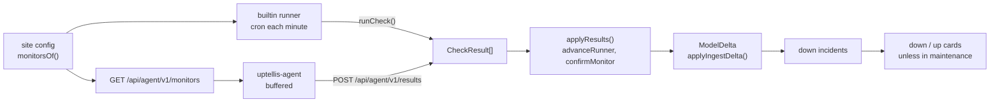

# Phase 6a contract: native monitors

The lead owns this contract. Streams code against it and never change a shape in `src/shared/monitors/` on
their own: they ask the lead. The shapes live in code:

| File | What it fixes |
|---|---|
| `src/shared/monitors/schema.ts` | `MonitorConfig` (`http`, `tcp`, `ping`, `tls`), runners (`builtin` plus declared agents), quorum, `MaintenanceWindow`, `AgentDecl`, `monitorsOf` (the legacy `probes` migrated), runner sources, target display |
| `src/shared/monitors/api.ts` | `CheckResult`, the agent API (`AgentMonitorsResponse`, `ResultsBatch`, `ResultsAccepted`), limits |
| `src/shared/monitors/check.ts` | The check library interface: `CheckTransport`, `RunCheck`, the quick retry, never throwing |
| `src/shared/monitors/confirm.ts` | `advanceRunner` and `confirmMonitor`: the only rule that turns results into a service status |
| `src/shared/config/site.ts` | `monitors`, `agents`, `maintenance` in the site config |

## Rules

- **Identity.** A monitor's service is `probe:<monitor id>`. A legacy probe becomes the monitor with the same id,
  so its history carries over. The service's `source` is the runner source of its first listed runner.
- **Runners.** `builtin` is the instance itself: `probe:cf` on Cloudflare (as before) and `probe:server` in
  Docker. An agent `office-1` reports as `probe:office-1`. Runner sources are implied by the config: sync adds them
  (expected interval = the smallest interval of the monitors that runner has, at least 60 s), so a silent
  agent raises a `stale` incident like any source.
- **Capabilities.** Cloudflare runs `http` and `tcp`; Docker and agents run all four types. A runner skips
  types it cannot run, and `confirmMonitor` gets them in `unsupported`.
- **Private targets.** Only agent-only monitors may target LAN names, tailnet names or addresses. Those
  targets are never displayed (`monitorTargetDisplay` returns null).
- **Retries.** A failing attempt is retried once after 2 s inside a check, so a blip is never reported.
  `retries` counts whole checks. A runner is failing on its first `down` result and confirmed down once
  `consecutiveDown > retries`.
- **Quorum.** The default is a strict majority of the runners. Only fresh runners count, meaning a result
  within `3 x interval + 60 s`. The service is down once `min(quorum, fresh runners)` confirm it. Too few
  confirmed downs give `degraded`, which is shown but never paged. Failing but unconfirmed gives `pending`.
- **Maintenance** outranks every result. The status is `maintenance`, no incident opens and no card is sent.
  Windows apply to any service of the site, not only monitors.
- **Results** apply in time order per (monitor, runner). A result that is not newer than the last applied
  one, older than 24 h, more than 60 s in the future, or for a monitor not assigned to that runner is
  `ignored`. The agent never resends ignored results.
- **Heartbeats.** Each applied result writes one heartbeat for the service with the verdict, at the result's
  `ts`. A heartbeat on the same second overwrites the earlier one.
- **Cards** come from `down` incidents opening and resolving, through the existing notifier. No second
  transition path exists.

## Streams

| Stream | Owns (writes) | Reads only |
|---|---|---|
| `monitors` | `src/worker/monitors/` (builtin runner, `applyResults`, runner state), `src/worker/routes/agent.ts` (both agent endpoints, `agent` scope, `X-Uptellis-Runner`), migration `0005_monitors.sql` (runner state per site, monitor and runner), `src/worker/engine/sites.ts` (implied runner sources), `src/worker/cron.ts` probes job, retirement of `src/worker/probes/` and `src/worker/adapters/probe.ts` | the contract; `runCheck` from `src/checks` (a fake until it lands) |
| `checkers` | `src/checks/` (`runCheck`, `http`, `tcp`, `ping`, `tls`, `bun-transport.ts`), `src/platform/cloudflare/check-transport.ts`, tests against real local servers (HTTP, TCP, TLS with a short-lived certificate, ping to localhost) | the contract |
| `agent` | `agent/` (Bun program: poll with ETag, schedule, buffer on disk, flush oldest first, backoff; `bun build --compile` for linux x64 and arm64; Dockerfile; systemd unit; README), agent jobs in `.github/workflows/` | the contract, `src/checks` (bundled into the binary) |
| `alerting` | `src/worker/notify/` (down and up cards from `down` incidents, maintenance suppression), `src/shared/monitors/maintenance.ts` (`inMaintenance(config, serviceId, nowMs)`, time zones by `Intl`), maintenance on non-monitor services in the read path, the admin editor for monitors, agents and windows in `src/client/lib/admin/` | the contract |

Every stream keeps `bun run verify` green on its branch, uses signed commits with Conventional Commit
headers of at most 100 characters, and passes `bun run leak-check`. The lead integrates the streams in the
order checkers, monitors, alerting, agent, then runs the live acceptance on staging (issue #1, Phase 6
statement of work).
