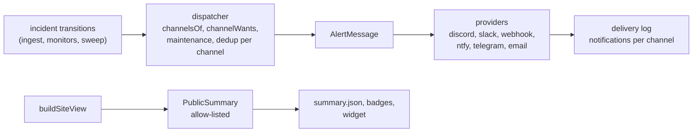

# Phase 6b contract: reach

The lead owns this contract. Streams code against it and never change a shape in `src/shared/notify/` or `src/shared/public/` on their own: they ask the lead. The shapes live in code:

| File | What it fixes |
|---|---|
| `src/shared/notify/schema.ts` | `ChannelConfig` (`discord`, `slack`, `webhook`, `ntfy`, `telegram`, `email`), events, the service filter, secret names (`NOTIFY_*`, `DISCORD_WEBHOOK_URL`), `channelsOf` (the historical Discord behaviour as an implicit channel), `channelWants` |
| `src/shared/notify/message.ts` | `AlertMessage`: the one message every provider renders |
| `src/shared/notify/webhook.ts` | The signed webhook: headers, `signWebhook` and `verifyWebhook` (HMAC-SHA256 over `<t>.<body>`) |
| `src/shared/notify/provider.ts` | `ChannelProvider`, `ProviderContext`, `DeliveryOutcome`, `EmailSender` |
| `src/shared/public/summary.ts` | `PublicSummary`, what each `public.fields` item unlocks, the public endpoints |
| `src/platform/types.ts` | `Platform.notifySecret(name)`, `Platform.email`, the `EMAIL_FROM` setting |
| `src/shared/config/site.ts` | `notify.channels` |

## Rules

- **Secrets.** A channel names a secret; `Platform.notifySecret` reads it (Cloudflare: Worker secrets; Docker: env or `NAME_FILE`) and refuses any name outside `ChannelSecretName`. No secret, URL, token, email address or response body is ever logged, stored in the delivery log or shown in admin.
- **Compatibility.** `channelsOf` adds a Discord channel on `DISCORD_WEBHOOK_URL` unless a configured channel uses that secret: `stale` and `recovered` always, `down` and `up` when `notify.discord` is on. A site with no `channels` behaves exactly as in 0.3.1. `notify.webhooks` is parsed and ignored.
- **Dispatch.** One `AlertMessage` per incident transition; every enabled channel that wants the event gets it. Maintenance suppresses `down` as today, and an `up` is sent to a channel only if its `down` was. Dedup is per (site, incident, kind, channel): the `notifications` table gains a `channel` column (default `discord` for existing rows) in a migration. A failing channel never blocks the others.
- **Retries.** A retryable outcome (429, 5xx, network) is retried with backoff, honouring `retryAfterS`, within the request (at most 3 attempts, under the platform's `waitUntil`) and then by the five-minute job for rows still `failed` and retryable, for up to 1 hour. A non-retryable outcome (bad config) is final.
- **Email.** The sender is instance-level: the Email Service `send_email` binding on Cloudflare; in Docker the Email Service REST API (`CLOUDFLARE_EMAIL_API_TOKEN`, `CLOUDFLARE_ACCOUNT_ID`) or `SMTP_URL`. Without one, email channels fail with `email_unavailable` (not retryable).
- **Public.** Only sites with `public.enabled` answer the public endpoints; every other site is 404. Each part of the summary exists only if its field is allowed; badges and the widget never show more than the summary.

## Streams

| Stream | Owns (writes) | Reads only |
|---|---|---|
| `channels` | `src/worker/notify/` (dispatcher replacing the Discord-only path, `providers/` for the six types, retries), the `notifications.channel` migration and schema, the email senders (`src/platform/cloudflare/` binding, `src/platform/docker/` REST and SMTP), `wrangler.jsonc` `send_email` binding, the five-minute retry, `POST /api/admin/notify/test?channel=<id>` | the contract |
| `public` | `src/worker/routes/public.ts` (summary, badges, widget HTML and script), SVG badge rendering, mounting in `src/worker/index.ts` and the Docker server, caching and CORS | the contract, `buildSiteView` |
| `admin` | `src/client/lib/admin/` channel editor (per type fields, events, services, send test), the delivery log view (and its read API `GET /api/admin/sites/:site/notifications`), the public settings editor with a live badge and widget preview | the contract; the `channels` and `public` endpoints by their documented shapes |

Every stream keeps `bun run verify` green, uses Conventional Commit headers of at most 100 characters with a lower-case subject, passes `bun run leak-check`, and does not commit: the lead signs and commits each stream's plan. Integration order: channels, public, admin; then the live acceptance on staging (issue #1, the Phase 6b statement of work).
