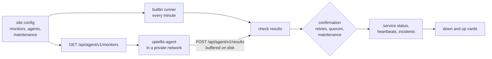
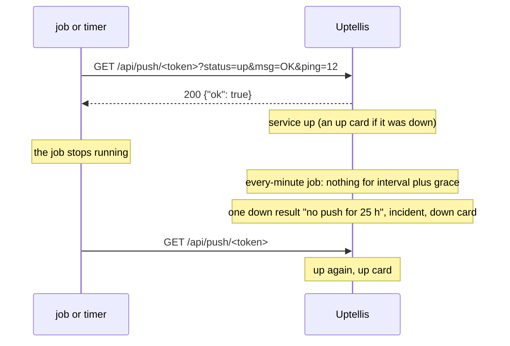

# Monitors

Uptellis runs its own checks: HTTP(S), TCP, ping and TLS certificate expiry. They run from the instance itself and from small agents inside private networks. Push monitors turn it around: a job or timer calls a URL to prove it is alive, and the monitor goes down when the calls stop. Failures are confirmed before anyone is paged, and maintenance windows keep planned work from counting as downtime. The Uptime Kuma collector, facts pushers and webhooks keep working as sources next to them.



## Monitor types

| Type | Checks | Up when |
|---|---|---|
| `http` | `GET` or `HEAD` of an `http` or `https` URL; redirects are never followed | the status is inside `expectStatus` (default 200 to 399) and, with `keyword`, the first 64 KiB of the body contain it (or lack it, with `keywordAbsent`) |
| `tcp` | a TCP connection to `host:port` | the connection opens |
| `ping` | one ICMP echo | a reply arrives |
| `tls` | a TLS handshake to `host:port` (default 443), SNI `servername` or `host` | the chain is valid for the name; `degraded` under `minDays` days left (default 7), `down` when expired or invalid |
| `push` | a push to its URL (see [Push monitors](#push-monitors)) | a push arrived within interval plus grace |

Every monitor but `push` has an `id`, a `name`, an `intervalS` (whole minutes, 60 to 3600), a `timeoutS` (1 to 30), `retries` (default 1), `runners` (default `["builtin"]`), an optional `quorum` and `enabled`. A failing attempt is retried once after 2 seconds inside the same check, so a blip is never reported. A paused monitor (`enabled: false`) shows as Paused on the page and in the dashboard even before its first check, and a new enabled one shows as Pending until it reports; neither counts as down.

```json
{
  "monitors": [
    { "id": "site", "name": "Website", "type": "http", "url": "https://example.org/", "keyword": "Welcome" },
    { "id": "cert", "name": "Certificate", "type": "tls", "host": "example.org", "minDays": 14 },
    { "id": "db", "name": "Database", "type": "tcp", "host": "db.internal", "port": 5432, "runners": ["office-1"] }
  ],
  "agents": [{ "id": "office-1", "name": "Office server" }]
}
```

A `push` monitor has only an `id`, a `name`, `intervalS` (60 to 86400 seconds, default 60), `graceS` (0 to 86400, default 60) and `enabled`: no runners, target, quorum, timeout or retries, because the push is the check.

Monitors are edited in admin (Config, Monitors) or in the site JSON. The legacy `probes` keep working: each one runs as an `http` monitor on `builtin` with the same service id, so its history carries over.

### Push monitors

A push monitor (a heartbeat) is for things that run on their own: a backup script, a cron job, a systemd timer. Each run calls the monitor's push URL; the monitor is up while the calls keep coming and goes down when none arrived for `intervalS` plus `graceS`.

```json
{ "id": "backup", "name": "Nightly backup", "type": "push", "intervalS": 86400, "graceS": 3600 }
```



**URL.** `GET` or `POST https://<your instance>/api/push/<token>`. Create it in admin (Config, Monitors, the monitor's "Create push URL") once the monitor is saved; the dialog shows the URL and a ready `curl` line once. "Rotate push URL" replaces it: the old URL stops at once.

| Parameter | Meaning |
|---|---|
| `status` | `up` (default) or `down`; `down` is down at once, with no retries |
| `msg` | the check message shown on the page and in cards, at most 200 characters; addresses, emails and anything that looks like a token are replaced with `[redacted]` |
| `ping` | the latency in whole milliseconds (ignored when empty or not a number) |

Parameters go in the query string; a `POST` may also send them as a form or as JSON (the body wins). Answers: `200 {"ok": true}` once applied; `404 {"ok": false}` for an unknown or rotated token, a monitor removed from the config and a paused monitor, all alike; `429` for more than one push per 10 seconds per token (`Retry-After: 10`); `400` for a `status` other than `up` or `down`. The route needs no session and no API key: the token is the credential.

**Token handling.** The token is 32 random bytes (base64url). Uptellis stores only its SHA-256 and shows the URL once; it never appears in logs, the delivery log, errors, the page, the public summary or snapshots. Admin lists when each URL was created and the last push, never the URL. Creating and rotating need the `sources.manage` permission, like ingest and API keys. Deleting the monitor from the config kills its URL; adding the same id again needs a new one.

**Silence.** The every-minute job checks each enabled push monitor. Silence counts from the last push, or from when the monitor was created or enabled again, whichever is later, so a new monitor that never received a push goes down `intervalS + graceS` after it was created, not at once (until then it shows `pending`, "waiting for a push"). The job writes one `down` result ("no push for 5 min"), which opens the incident and sends the down card; while it stays silent it adds only a heartbeat per interval, so the beat bars and uptime count the time as down without repeating the alert. The next push brings it up with an up card. Maintenance windows, paused monitors (`enabled: false`), per-channel alerts and removed monitors work as for every other monitor.

Examples:

```sh
# At the end of a script
curl -fsS "https://status.example.com/api/push/<token>?status=up&msg=OK"

# Report a failure with a reason
curl -fsS "https://status.example.com/api/push/<token>?status=down&msg=disk%20full"

# POST with a form body
curl -fsS -X POST --data "status=up&msg=backup%20done&ping=1200" https://status.example.com/api/push/<token>
```

A systemd service run by a timer can push after its work succeeds:

```ini
[Service]
Type=oneshot
ExecStart=/usr/local/bin/backup.sh
ExecStartPost=/usr/bin/curl -fsS "https://status.example.com/api/push/<token>?status=up&msg=OK"
```

or push as the only step of its own timer: `ExecStart=/usr/bin/curl -fsS "https://status.example.com/api/push/<token>?status=up&msg=OK"`.

**Moving from Uptime Kuma.** Kuma's push URLs look like `https://kuma.example.com/api/push/<token>?status=up&msg=OK&ping=`. Create the push monitor in Uptellis, then swap the base URL and the token in each job: the `status`, `msg` and `ping` parameters are the same.

## Runners

| Runner | Where it runs | Types |
|---|---|---|
| `builtin` on Cloudflare | the Worker's cron, from Cloudflare's edge | `http`, `tcp` |
| `builtin` in Docker | the container's scheduler | `http`, `tcp`, `ping`, `tls` |
| an agent (`uptellis-agent`) | inside your network, see [agent/README.md](../agent/README.md) | `http`, `tcp`, `ping`, `tls` |

No runner runs a `push` monitor: its pushes are its results (reported as `probe:push`, which never goes stale), and agents are never handed one.

A runner skips types it cannot run, and confirmation leaves it out. Each runner reports as its own source (`probe:cf`, `probe:server`, `probe:<agent id>`), so an agent that goes silent raises its own `stale` incident. You never have to list these sources in the config.

**Private targets.** Only monitors run by agents alone may target LAN names, tailnet names or IP addresses. Their targets are never shown on the page.

**Cloudflare's TCP limit.** On Cloudflare, Workers sockets cannot connect to Cloudflare's own address ranges, so a `tcp` monitor on `builtin` fails for a host that is proxied by Cloudflare. Check such hosts with an `http` monitor (fetch is not affected) or from an agent. Durable Objects share the limit.

## Confirmation

Results turn into one service status:

1. A runner is **failing** on its first `down` result and **confirmed down** once it has failed `retries + 1` checks in a row.
2. Only runners that reported within three intervals plus a minute count. A silent runner never blocks a verdict: the others decide.
3. With enough runners confirmed down (`quorum`, default a strict majority: 1 of 1, 2 of 2, 2 of 3), the service is `down` and an incident opens.
4. Too few confirmed downs show `degraded` ("down from office-1"), which is visible but never paged. A failing runner that is not yet confirmed shows `pending`.
5. Inside a maintenance window the service shows `maintenance` whatever the results say.

A push monitor has one runner (its URL), no retries and no quorum: each push is final.

Only `down` opens an incident, and only the transitions into and out of `down` send cards.

## Maintenance windows

A window covers the services it lists, or every service of the site when `services` is empty. That includes services from Kuma, facts or webhooks, not only monitors. Inside a window a service shows `maintenance`, no incident opens and no card is sent.

```json
{
  "maintenance": [
    { "kind": "once", "id": "upgrade", "title": "Database upgrade", "services": ["probe:db"],
      "start": "2026-10-01T22:00:00Z", "end": "2026-10-01T23:30:00Z" },
    { "kind": "weekly", "id": "patching", "title": "Weekly patching", "services": [],
      "days": ["sun"], "start": "03:00", "durationMin": 60, "timeZone": "Europe/Paris" }
  ]
}
```

Weekly windows use the given time zone, including daylight saving changes, and may cross midnight.

## Cards

Every transition (a service `down` and back `up`, a source `stale` and `recovered`) becomes one alert message, sent to every notification channel of the site that wants it (`notify.channels`: Discord, Slack, a webhook (plain or signed), ntfy, Telegram, email or SMS; each with its `events`, and for `down` and `up` optionally its `services`). The contract is in [contracts/phase-6b.md](contracts/phase-6b.md).

- **Discord** keeps the cards it always had: a red card for `down` (service, target, runner, since, reason), a green one with the outage duration for `up`, a dark red one for a silent source (last report, expected interval, still reporting) and a green one when it is back (silent for, beats backfilled).
- **Slack** gets the same facts in Block Kit with the event's colour, **ntfy** a text notification (priority 5 for down, 4 for stale, 3 for back, a click to the status page), **Telegram** an HTML message, **email** a plain text and an HTML part (subject `[Uptellis] Checkout is down`), **SMS** one short plain text of at most 160 characters (`DOWN: Checkout (Acme Cloud) since 14:02 UTC. status.example.com`).
- **Webhook** gets the message itself as JSON, with `X-Uptellis-Event` and an `X-Uptellis-Delivery` id that stays the same across retries of one delivery. It is signed with HMAC-SHA256 (`X-Uptellis-Signature: t=<unix>,v1=<hex>` over `<t>.<body>`) when the channel names a `signingSecret`, and plain otherwise; an optional `authSecret` is sent as the `Authorization` header ([Webhook setup](#webhook-setup)).

Without configured channels a site behaves as before: the historical Discord channel on `DISCORD_WEBHOOK_URL` gets `stale` and `recovered` always, and `down` and `up` when `notify.discord` is on (admin, Config, "Alerts").

Rules that hold on every channel:

- Each transition is sent at most once per channel (the delivery log, the `notifications` table, one row per incident, transition and channel).
- A service in a maintenance window when its incident starts sends no `down` anywhere. An `up` (or `recovered`) goes to a channel only if its `down` (or `stale`) was sent there or may still be. A source removed from the config is resolved quietly (its `stale` incident and the open `down` incidents of its services, note "Source removed from the config"), and so is the open `down` incident of a monitor removed from the config (by the five-minute job, note "Monitor removed from the config"); the page, the public summary, badges and the widget stop listing that monitor at once, while its history stays stored.
- A failing channel never holds up the others. A 429, 5xx, timeout or network error is retried up to 3 times within the request (honouring the service's `Retry-After`), then by the five-minute cron for up to an hour; a config problem (404, bad URL, missing secret, `email_unavailable`) is final. The log keeps a short error code, never a URL, token, address or response body.
- `POST /api/admin/notify/test?site=<slug>&kind=<down|up|stale|recovered>&channel=<id>` sends a TEST message to one channel (any of the site's channels, the implicit `discord` included) and records nothing; without `channel` it posts to `DISCORD_WEBHOOK_URL` as before.

### Telegram setup

Each install sends from its own bot: a bot token controls the bot, so Uptellis cannot ship a shared one. Setting one up takes a couple of minutes:

1. In Telegram, open [@BotFather](https://t.me/BotFather), send `/newbot`, and pick a name and a username ending in `bot`. BotFather replies with the bot token. `/setuserpic`, `/setdescription` and `/setabouttext` there give the bot a picture and texts.
2. Store the token as a secret named `NOTIFY_<NAME>`, e.g. `bunx wrangler secret put NOTIFY_TELEGRAM` on Cloudflare (it prompts for the value) or `NOTIFY_TELEGRAM=` in `docker.env` for Docker.
3. Let the bot reach the chat: open the bot and press Start for a private chat, or add it to a group or channel (in a channel, as an administrator that may post).
4. Find the chat id: a private chat's id is your user id and a group's is negative (`-100...` for a supergroup); a public channel can be named as `@channelname`. One way to read it: send the bot a message, then open `https://api.telegram.org/bot<token>/getUpdates` and look for `chat.id`.
5. Add the channel in admin (Config, Alerts) or in the config, then send a test with `POST /api/admin/notify/test?site=<slug>&kind=down&channel=<id>`:

```json
{ "id": "telegram", "name": "Telegram", "type": "telegram", "secret": "NOTIFY_TELEGRAM", "chatId": "123456789" }
```

### Webhook setup

A webhook channel POSTs the alert message as JSON to the URL in its `secret`, with `Content-Type: application/json`, `User-Agent: uptellis/<version>`, `X-Uptellis-Event` (`down`, `up`, `stale`, `recovered`) and `X-Uptellis-Delivery` (the same id on every retry of one delivery, so a receiver can drop duplicates). A 2xx answer is a delivery; a 429, 5xx, timeout or network error is retried. Store each value as a `NOTIFY_<NAME>` secret like any other channel secret, then send a test with `POST /api/admin/notify/test?site=<slug>&kind=down&channel=<id>`.

A plain webhook, for a receiver that checks nothing:

```json
{ "id": "hook", "name": "Receiver", "type": "webhook", "secret": "NOTIFY_HOOK" }
```

With an `Authorization` header, for n8n, Home Assistant or a Zapier-style receiver: the value of `authSecret` is sent as the header as is, so store the whole value (`Bearer <token>`, `Basic <base64 of user:password>`). It is never logged or written to the delivery log. A named `authSecret` that is not set fails the delivery with `secret_missing`, and a value with a line break fails with `bad_auth_header`, without a request:

```json
{ "id": "n8n", "name": "n8n", "type": "webhook", "secret": "NOTIFY_N8N", "authSecret": "NOTIFY_N8N_AUTH" }
```

Signed, so the receiver can prove a POST came from this instance (add `authSecret` too if the receiver also wants the header):

```json
{ "id": "hook", "name": "Receiver", "type": "webhook", "secret": "NOTIFY_HOOK", "signingSecret": "NOTIFY_HOOK_SIGNING" }
```

A signed POST carries `X-Uptellis-Signature: t=<unix seconds>,v1=<hex>`, where `v1` is the HMAC-SHA256 of `<t>.<raw body>` keyed with the signing secret (the Stripe scheme). To verify, recompute it over the raw body as received, compare in constant time, and reject a `t` more than 300 seconds from your clock. `verifyWebhook` in `src/shared/notify/webhook.ts` does exactly this.

### SMS setup (Twilio)

An SMS channel texts one number through your own Twilio account. Every text costs money, so an SMS channel gets `down` and `up` unless you set its `events` (add `stale` and `recovered` explicitly if you want them). The texts are plain ASCII of at most 160 characters, with the service and site names shortened when needed and the status page link kept:

```text
DOWN: Checkout (Acme Cloud) since 14:02 UTC. status.example.com
UP: Checkout (Acme Cloud) is back after 12 min. status.example.com
STALE: source kuma:watch-1 (Acme Cloud) silent since 14:02 UTC.
RECOVERED: source kuma:watch-1 (Acme Cloud) is reporting again.
```

A test starts with `TEST `.

1. Create a Twilio account. A trial works, with two limits: it texts only numbers verified in the Twilio console (Phone Numbers, Verified Caller IDs), and every message starts with a trial notice.
2. In the Twilio console, find the Account SID (`AC` and 32 hex characters) and the Auth Token on the account dashboard.
3. Get a Twilio number that can send SMS (Phone Numbers, Buy a number; a trial account gets one for free), or create a Messaging Service and use its SID (`MG...`) as `from`.
4. Store the auth token as a secret named `NOTIFY_<NAME>`, e.g. `bunx wrangler secret put NOTIFY_TWILIO_TOKEN` on Cloudflare (it prompts for the value) or `NOTIFY_TWILIO_TOKEN=` in `docker.env` for Docker. The Account SID and the numbers go in the config.
5. Add the channel in admin (Config, Alerts, type "SMS (Twilio)") or in the config, then send a test with `POST /api/admin/notify/test?site=<slug>&kind=down&channel=<id>`:

```json
{ "id": "sms-oncall", "name": "SMS (on call)", "type": "sms", "provider": "twilio",
  "accountSid": "ACxxxxxxxxxxxxxxxxxxxxxxxxxxxxxxxx", "secret": "NOTIFY_TWILIO_TOKEN",
  "from": "+15551234567", "to": "+15557654321" }
```

`from` is an E.164 number (`+`, country code, number) or a Messaging Service SID; `to` is exactly one E.164 number. To text a second person, add a second channel: each channel is sent each transition once and retried on its own. The numbers are personal data: they never appear in logs, the delivery log, error codes or anything public. A failed text is logged by a short code: `bad_token` (401 or 403, or a token that is not 32 hex characters), `invalid_number` (Twilio 21211, 21614), `unverified_number` (21608, a trial account texting an unverified number), `invalid_from` (21212, 21606, 21659, 21660), `opted_out` (21610, the recipient replied STOP), `region_disabled` (21408, enable the country in the console's Geo Permissions) or `twilio_<code>`; these are final, while a 429, 5xx or network error is retried.

## Agent API

Agents use a site API key with the `agent` scope and name themselves in `X-Uptellis-Runner`; the agent must be declared in the site's `agents`.

| Endpoint | Does |
|---|---|
| `GET /api/agent/v1/monitors` | the enabled monitors that list this agent, with an ETag (`If-None-Match` answers 304) |
| `POST /api/agent/v1/results` | a batch of up to 500 results (256 KiB), oldest first; answers 202 with `accepted` and `ignored` |

Resending a result is harmless: one that is not newer than the last applied result of its monitor is ignored. Errors: 400 invalid body, 401 bad or revoked key, 403 missing scope or unknown runner, 413 too large, 429 rate limited.
