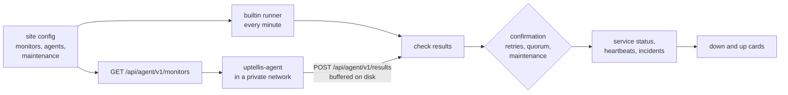

# Monitors

Uptellis runs its own checks: HTTP(S), TCP, ping and TLS certificate expiry. They run from the instance itself and from small agents inside private networks. Failures are confirmed before anyone is paged, and maintenance windows keep planned work from counting as downtime. The Uptime Kuma collector, facts pushers and webhooks keep working as sources next to them.



## Monitor types

| Type | Checks | Up when |
|---|---|---|
| `http` | `GET` or `HEAD` of an `http` or `https` URL; redirects are never followed | the status is inside `expectStatus` (default 200 to 399) and, with `keyword`, the first 64 KiB of the body contain it (or lack it, with `keywordAbsent`) |
| `tcp` | a TCP connection to `host:port` | the connection opens |
| `ping` | one ICMP echo | a reply arrives |
| `tls` | a TLS handshake to `host:port` (default 443), SNI `servername` or `host` | the chain is valid for the name; `degraded` under `minDays` days left (default 7), `down` when expired or invalid |

Every monitor has an `id`, a `name`, an `intervalS` (whole minutes, 60 to 3600), a `timeoutS` (1 to 30), `retries` (default 1), `runners` (default `["builtin"]`), an optional `quorum` and `enabled`. A failing attempt is retried once after 2 seconds inside the same check, so a blip is never reported.

```json
{
  "monitors": [
    { "id": "site", "name": "Website", "type": "http", "url": "https://example.org/", "keyword": "Welcome" },
    { "id": "cert", "name": "Certificate", "type": "tls", "host": "example.org", "minDays": 14 },
    { "id": "db", "name": "Database", "type": "tcp", "host": "db.internal", "port": 5432, "runners": ["office-1"] }
  ],
  "agents": [{ "id": "office-1", "name": "Office server" }]
}
```

Monitors are edited in admin (Config, Monitors) or in the site JSON. The legacy `probes` keep working: each one runs as an `http` monitor on `builtin` with the same service id, so its history carries over.

## Runners

| Runner | Where it runs | Types |
|---|---|---|
| `builtin` on Cloudflare | the Worker's cron, from Cloudflare's edge | `http`, `tcp` |
| `builtin` in Docker | the container's scheduler | all four |
| an agent (`uptellis-agent`) | inside your network, see [agent/README.md](../agent/README.md) | all four |

A runner skips types it cannot run, and confirmation leaves it out. Each runner reports as its own source (`probe:cf`, `probe:server`, `probe:<agent id>`), so an agent that goes silent raises its own `stale` incident. You never have to list these sources in the config.

**Private targets.** Only monitors run by agents alone may target LAN names, tailnet names or IP addresses. Their targets are never shown on the page.

**Cloudflare's TCP limit.** On Cloudflare, Workers sockets cannot connect to Cloudflare's own address ranges, so a `tcp` monitor on `builtin` fails for a host that is proxied by Cloudflare. Check such hosts with an `http` monitor (fetch is not affected) or from an agent. Durable Objects share the limit.

## Confirmation

Results turn into one service status:

1. A runner is **failing** on its first `down` result and **confirmed down** once it has failed `retries + 1` checks in a row.
2. Only runners that reported within three intervals plus a minute count. A silent runner never blocks a verdict: the others decide.
3. With enough runners confirmed down (`quorum`, default a strict majority: 1 of 1, 2 of 2, 2 of 3), the service is `down` and an incident opens.
4. Too few confirmed downs show `degraded` ("down from office-1"), which is visible but never paged. A failing runner that is not yet confirmed shows `pending`.
5. Inside a maintenance window the service shows `maintenance` whatever the results say.

Only `down` opens an incident, and only the transitions into and out of `down` send cards.

## Maintenance windows

A window covers the services it lists, or every service of the site when `services` is empty. That includes services from Kuma, facts or webhooks, not only monitors. Inside a window a service shows `maintenance`, no incident opens and no card is sent.

```json
{
  "maintenance": [
    { "kind": "once", "id": "upgrade", "title": "Database upgrade", "services": ["probe:db"],
      "start": "2026-10-01T22:00:00Z", "end": "2026-10-01T23:30:00Z" },
    { "kind": "weekly", "id": "patching", "title": "Weekly patching", "services": [],
      "days": ["sun"], "start": "03:00", "durationMin": 60, "timeZone": "Europe/Paris" }
  ]
}
```

Weekly windows use the given time zone, including daylight saving changes, and may cross midnight.

## Cards

With `notify.discord` on (admin, Config, "Alerts") and the `DISCORD_WEBHOOK_URL` secret set, a service going `down` posts a red card (service, target, runner, since, reason). Its recovery posts a green card with the outage duration. Each card is sent once per incident. A service in a maintenance window sends none. Cards for silent sources work as before.

## Agent API

Agents use a site API key with the `agent` scope and name themselves in `X-Uptellis-Runner`; the agent must be declared in the site's `agents`.

| Endpoint | Does |
|---|---|
| `GET /api/agent/v1/monitors` | the enabled monitors that list this agent, with an ETag (`If-None-Match` answers 304) |
| `POST /api/agent/v1/results` | a batch of up to 500 results (256 KiB), oldest first; answers 202 with `accepted` and `ignored` |

Resending a result is harmless: one that is not newer than the last applied result of its monitor is ignored. Errors: 400 invalid body, 401 bad or revoked key, 403 missing scope or unknown runner, 413 too large, 429 rate limited.
