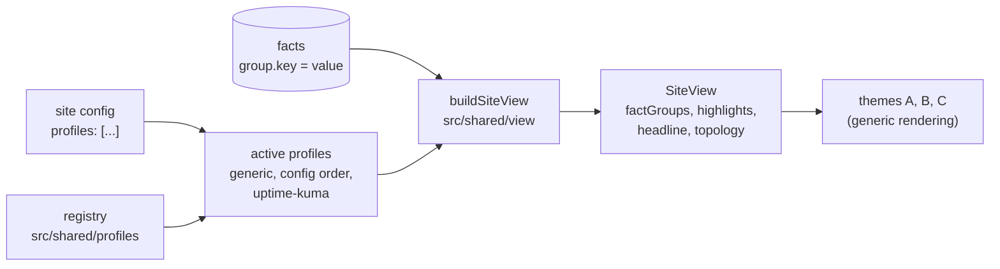

# Profiles

A **profile** teaches Uptellis about one kind of system. Producers push typed facts in named groups (`forgejo.version`, `replication.lagSeconds`); the Worker stores them without knowing what they mean. A profile says what they mean:

- which **groups and keys** its producer sends, with a label, a format, a unit and a level for each key;
- how to **fold** keys into others (`runners.total` into `runners.online` as "2 of 2") and a one-line **summary** per group;
- which facts deserve a place in a theme's summary (**highlights**, with an optional badge), and one **headline** sentence;
- how facts **shape the topology**: node states, notes and card rows, edge liveness and detail, the fence stamp;
- where its **producer's install guide** lives.

The view-model and the themes never name a group or key. They apply the active profiles and render what those declare, so adding a profile needs no view-model or theme change.



## Which profiles are active

A site lists profiles in its config (`"profiles": ["forgejo-ha"]`). The active profiles, in order, are:

1. `generic`, always;
2. the config's `profiles`, as listed (an id the registry does not know is skipped);
3. `uptime-kuma`, when the site has a Kuma source.

The order matters: the first profile that declares a group sets its title, icon, order and summary (later ones may add keys), highlights and the headline follow the profile order, and topology hooks run one after the other.

## Built-in profiles

| Id | Groups | What it adds |
| --- | --- | --- |
| `generic` | none | Every group and key no other profile knows renders with a humanised label (`lagSeconds` is "Lag seconds") and a format inferred from the value: booleans read yes/no, timestamps as "27 min ago" or "in 3 h", numbers with unit `%` as a percentage with a gauge, `s` as a duration, `bytes` in binary units, any other unit after the number. |
| `uptime-kuma` | `kuma` | The Kuma collector's view of the instance it reads: reachability, version and latest version, database size, host and timezone. Highlights the version (with a "latest" or "x available" badge, never offering an older release), the database size, the host and the timezone. |
| `forgejo-ha` | `forgejo`, `replication`, `fence`, `backup`, `runners`, `disk`, `watchdog` | The Forgejo failover pair of [profiles/forgejo-ha](../profiles/forgejo-ha/README.md): levels against the site's `thresholds` (replication lag, backup age), the serving node, standby, primary and reporter in the topology with their card rows, the replication edge's liveness and lag, the fence stamp, the watchdog node, and a headline ("Forgejo serving from app-1, replication streaming"). |

## Formats

| Format | Value | Shown as |
| --- | --- | --- |
| `text` | string | as is, then the unit |
| `number` | number | `41.2 MB` (the fact's unit, else the key's `unit`) |
| `bytes` | number | `73.7 MiB` |
| `duration` | seconds | `18 s`, `3 min` |
| `age` | timestamp in the past | `27 min ago` (a little ahead of the clock reads "just now") |
| `until` | timestamp in the future | `in 4 h`, or `due now` once past |
| `percent` | 0..100 | `16%` and a gauge |
| `bool` | boolean | yes/no, or the key's `labels` |
| `list` | comma or newline separated string | `a, b, c` |
| `timestamp` | timestamp | `2026-09-27 23:31:44 UTC` |

A format that does not fit the value's type (for example `bytes` on the string "1.2 GiB") falls back to the inferred one. A key's `display` hook overrides the text; its `level` hook gives the row's level, and the row shows the worse of that and the producer's own severity.

## Writing a profile

1. Write the producer: anything that signs and POSTs a `FactsPayload` to `/api/ingest/facts` (see [profiles/forgejo-ha/push-facts.sh](../profiles/forgejo-ha/push-facts.sh) for a complete one). Keep group and key names stable: they are the contract between the producer and the profile.
2. Describe it in `src/shared/profiles/<id>.ts` as a `Profile` (types in `src/shared/profiles/types.ts`), and add it to the registry in `src/shared/profiles/index.ts`. A profile kept outside this repo can call `registerProfile` instead.
3. Enable it on a site: `"profiles": ["<id>"]`.
4. Test it the way `tests/unit/profiles.test.ts` does: build a view from a fixture with your facts and check the rows, levels and highlights, and that every theme renders them.

A small example, for a queue whose producer sends `queue.depth` and `queue.consumers`:

```ts
import { num, own } from "./read";
import type { Profile } from "./types";

export const acmeQueue: Profile = {
  id: "acme-queue",
  name: "Acme queue",
  description: "A message queue: backlog and consumers.",
  groups: [
    {
      id: "queue",
      title: "Message queue",
      icon: "database",
      order: 5,
      keys: [
        {
          key: "depth",
          label: "Depth",
          format: "number",
          unit: "msgs",
          level: (f) => ((own.num(f) ?? 0) > 100 ? "warn" : "ok"),
        },
        { key: "consumers", label: "Consumers", format: "number" },
      ],
      summary: (ctx) => `${num(ctx, "queue.depth") ?? "-"} waiting, ${num(ctx, "queue.consumers") ?? "-"} consumers`,
    },
  ],
  highlights: [{ fact: "queue.depth", label: "queue" }],
  headline: (ctx) => ((num(ctx, "queue.depth") ?? 0) > 100 ? "Queue backing up" : null),
  producerGuide: "profiles/acme-queue/README.md",
};
```

## How themes use it

Themes read the result, never the profile: `factGroups` (title, icon, summary, level and rows), `highlights` (label, row and note; highlights sharing a label form one summary slot), `headline`, and `topology` (node notes and `details`, edge `live` and `detail`, the fence). See [THEMES.md](THEMES.md#facts-highlights-and-topology).
