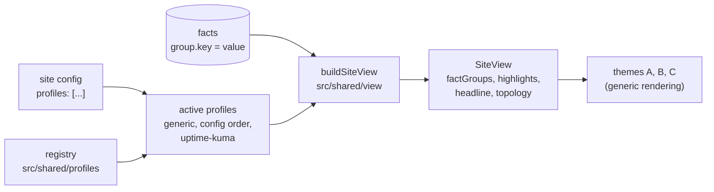

# Profiles

A **profile** teaches Uptellis about one kind of system. Producers push typed facts in named groups (`forgejo.version`, `replication.lagSeconds`); the Worker stores them without knowing what they mean. A profile says what they mean:

- which **groups and keys** its producer sends, with a label, a format, a unit and a level for each key;
- how to **fold** keys into others (`runners.total` into `runners.online` as "2 of 2") and a one-line **summary** per group, as a string or as coloured **summary parts**;
- which facts deserve a place in a theme's summary (**highlights**, with an optional badge), and one **headline** sentence;
- how facts **shape the topology**: node states, notes and card rows, edge liveness and detail, the fence stamp and its detail (`fence.detail`, contract addition, e.g. "tl 1/1"), and which groups the topology already draws (`inTopology`, contract addition);
- where its **producer's install guide** lives.

The view-model and the themes never name a group or key. They apply the active profiles and render what those declare, so adding a profile needs no view-model or theme change.



## Which profiles are active

A site lists profiles in its config (`"profiles": ["forgejo-ha"]`). The active profiles, in order, are:

1. `generic`, always;
2. the config's `profiles`, as listed (an id the registry does not know is skipped);
3. `uptime-kuma`, when the site has a Kuma source.

The order matters: the first profile that declares a group sets its title, icon, order and summary (later ones may add keys), highlights and the headline follow the profile order, and topology hooks run one after the other.

## Built-in profiles

| Id | Groups | What it adds |
| --- | --- | --- |
| `generic` | none | Every group and key no other profile knows renders with a humanised label (`lagSeconds` is "Lag seconds") and a format inferred from the value: booleans read yes/no, timestamps as "27 min ago" or "in 3 h", numbers with unit `%` as a percentage with a gauge, `s` as a duration, `bytes` in binary units, any other unit after the number. |
| `uptime-kuma` | `kuma` | The Kuma collector's view of the instance it reads: reachability, version and latest version, database size, host and timezone. Highlights the version (with a "latest" or "x available" badge, never offering an older release), the database size, the host and the timezone. |
| `forgejo-ha` | `forgejo`, `replication`, `fence`, `backup`, `runners`, `disk`, `watchdog` | The Forgejo failover pair of [profiles/forgejo-ha](../profiles/forgejo-ha/README.md): levels against the site's `thresholds` (replication lag, backup age), the serving node, standby, primary and reporter in the topology with their card rows, the replication edge's liveness and lag, the fence stamp, the watchdog node, and a headline ("Forgejo serving from app-1, replication streaming"). |

## Formats

| Format | Value | Shown as |
| --- | --- | --- |
| `text` | string | as is, then the unit |
| `number` | number | `41.2 MB` (the fact's unit, else the key's `unit`) |
| `bytes` | number | `73.7 MiB` |
| `duration` | seconds | `18 s`, `3 min` |
| `age` | timestamp in the past | `27 min ago` (a little ahead of the clock reads "just now") |
| `until` | timestamp in the future | `in 4 h`, or `due now` once past |
| `percent` | 0..100 | `16%` and a gauge |
| `bool` | boolean | yes/no, or the key's `labels` |
| `list` | comma or newline separated string | `a, b, c` |
| `timestamp` | timestamp | `2026-09-27 23:31:44 UTC` |

A format that does not fit the value's type (for example `bytes` on the string "1.2 GiB") falls back to the inferred one. A key's `display` hook overrides the text; its `level` hook gives the row's level, and the row shows the worse of that and the producer's own severity.

## Summary parts

A group's summary is one line for a compact row. `summary` gives it as a string; `summaryParts` (contract addition) gives it as parts that a theme colours: `{ text, level, emphasis? }`, where `ok`, `warn` and `crit` take their state colours, `info` is secondary text, a null level is plain and `emphasis` is bold. Themes put a space between parts, so a separator is a part of its own. With only parts, the summary string is their texts joined by spaces; with only a string, the view makes it one plain part.

`src/shared/profiles/read.ts` has helpers: `part(text, level, emphasis)`, `runs(...)` (joins runs of parts with a secondary "·" and drops missing parts), `keyLevel(ctx, groups, "group.key")` (a fact's level as its row shows it) and `quiet(level)` (secondary text unless the level warns or fails). `forgejo-ha` builds its lines this way:

```ts
summaryParts: (ctx) =>
  runs(
    [part(version)],                                          // 16.0.5, plain
    [part("HTTP 200", keyLevel(ctx, groups, "forgejo.healthzCode"))], // green, red when failing
    [part("serving app-1", "info")],                          // secondary
  ), // 16.0.5 · HTTP 200 · serving app-1
```

## Last known values

A fact has a freshness window (`freshForS`). Past it, or while its source is stale, a profile keeps showing the fact's last value and marks it, never replacing it with a word that hides the number. `src/shared/profiles/read.ts` has two helpers for any profile: `staleAge(ctx, "group.key")` is how long ago such a fact was observed ("13 min ago", null while current or never seen) and `lastKnown(ctx, "group.key", text)` appends it ("lag 0 s, 13 min ago"). `forgejo-ha` shows a stale replication lag this way on the edge, on the standby's `wal` card row (state `stale`), in the group's summary (muted) and in the headline ("replication lag 0 s, 40 min ago"), unless the replication state says why nothing streams ("no standby streaming").

## Several sources

Two producers may report the same keys, for example a pusher on each node of a failover pair. Uptellis stores each source's facts apart (the `facts` table is keyed by site, source, group and key), and the view combines them:

- `ProfileContext.facts` holds one fact per `group.key`. With one facts source it is that source's facts, exactly as before. With several, the first active profile whose `selectFacts(ctx)` hook (contract addition) returns a map decides; otherwise the newest observation per key wins, which suits sources that report different keys.
- `ProfileContext.sources` (contract addition) lists each source's own current facts as `{ source, node, facts }`, ordered by node. `node` comes from the first active profile whose `nodeOf(facts)` hook (contract addition) names one (`forgejo-ha` reads `forgejo.node`), else from the source id (`facts:app-2` -> `app-2`).
- A group marked `perNode` (contract addition) describes one node, not the system. When more than one source reports it, the group lists every source's rows, each labelled with its node (`Root filesystem (app-2)`) and carrying `FactRowView.node` (contract addition). The rows of the source behind `ctx.facts` keep their keys (`disk.percent` in `factIndex`); the others are keyed `<key>@<node>` (`disk.percent@app-2`). Such a group counts as fresh only while every node's rows are, and its `observedAt` is the stalest node's.

`forgejo-ha` reads the pair from the primary while its facts are current, else from the other node, and shows disk per node; the rule is in [profiles/forgejo-ha/README.md](../profiles/forgejo-ha/README.md#two-pushers-one-page).

## Groups the topology draws

A group's `inTopology(topology)` hook (contract addition) returns true when the profile's topology hook already draws the group's facts into the refined topology. `forgejo-ha` marks `replication` while the topology has a replication edge (its liveness and lag, the pair's `postgres` and `wal` card rows) and `fence` while it has a fence stamp (decision, reason, timelines). The view sets `FactGroupView.inTopology` from it, and always false when the site has no topology. A theme that draws that part of the topology (B and C draw the failover pair) leaves such a group out of its fact tiles or lines; a theme without a topology diagram, or a site without a topology, lists it as usual.

## Highlight slots

A highlight's `slot` (contract addition) places it in a theme's summary: lower slots come first, highlights without a slot follow in profile order. The figures a theme draws itself hold fixed slots (`SUMMARY_SLOTS` in `src/shared/view`: monitors 10, avg response 20, health 40, uptime 24h 50, uptime 30d 60, snapshot 80), so a highlight can sit between two of them. The built-ins use 30 for the Kuma version and database size (after the average response), 70 for the collector's host and timezone (before the snapshot) and 90 for the watchdog (last), which gives theme A's summary box its three columns: monitors, avg resp, kuma | health, uptime 24h, uptime 30d | collector, snapshot, watchdog. Highlights sharing a label form one slot and should share its number.

A highlight's `prefix` (contract addition) is a short word before its value, for a detail whose slot label does not name it: the Kuma slot shows "2.5.5 latest · db 41.2 MB" with `{ fact: "kuma.dbSize", label: "kuma", slot: 30, prefix: "db" }`.

## Writing a profile

1. Write the producer: anything that signs and POSTs a `FactsPayload` to `/api/ingest/facts` (see [profiles/forgejo-ha/push-facts.sh](../profiles/forgejo-ha/push-facts.sh) for a complete one). Keep group and key names stable: they are the contract between the producer and the profile.
2. Describe it in `src/shared/profiles/<id>.ts` as a `Profile` (types in `src/shared/profiles/types.ts`), and add it to the registry in `src/shared/profiles/index.ts`. A profile kept outside this repo can call `registerProfile` instead.
3. Enable it on a site: `"profiles": ["<id>"]`.
4. Test it the way `tests/unit/profiles.test.ts` does: build a view from a fixture with your facts and check the rows, levels and highlights, and that every theme renders them.

A small example, for a queue whose producer sends `queue.depth` and `queue.consumers`:

```ts
import { num, own } from "./read";
import type { Profile } from "./types";

export const acmeQueue: Profile = {
  id: "acme-queue",
  name: "Acme queue",
  description: "A message queue: backlog and consumers.",
  groups: [
    {
      id: "queue",
      title: "Message queue",
      icon: "database",
      order: 5,
      keys: [
        {
          key: "depth",
          label: "Depth",
          format: "number",
          unit: "msgs",
          level: (f) => ((own.num(f) ?? 0) > 100 ? "warn" : "ok"),
        },
        { key: "consumers", label: "Consumers", format: "number" },
      ],
      summary: (ctx) => `${num(ctx, "queue.depth") ?? "-"} waiting, ${num(ctx, "queue.consumers") ?? "-"} consumers`,
    },
  ],
  highlights: [{ fact: "queue.depth", label: "queue" }],
  headline: (ctx) => ((num(ctx, "queue.depth") ?? 0) > 100 ? "Queue backing up" : null),
  producerGuide: "profiles/acme-queue/README.md",
};
```

## How themes use it

Themes read the result, never the profile: `factGroups` (title, icon, summary and its parts, level, rows and `inTopology`), `highlights` (label, row and note; highlights sharing a label form one summary slot), `headline`, and `topology` (node notes and `details`, edge `live` and `detail`, the fence). See [THEMES.md](THEMES.md#facts-highlights-and-topology).
