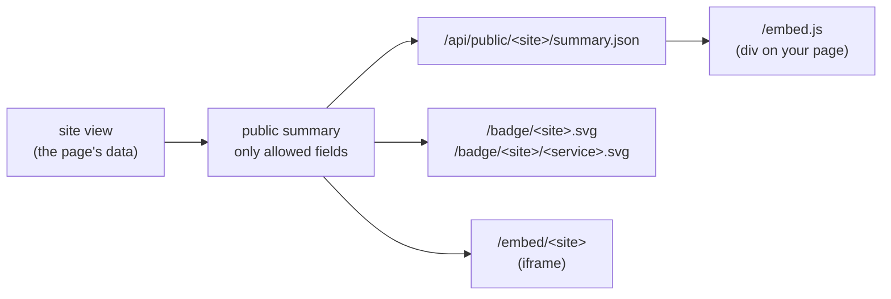

# Public status

A site can share a small, allow-listed summary of its status outside its page: a JSON document, shields-style badges and an embeddable widget. Nothing is shared until you turn it on, and each part is shared only when you allow it.



## Turning it on

In the site config (admin, or the site JSON):

```json
{
  "visibility": "public",
  "public": {
    "enabled": true,
    "fields": ["verdict", "sections", "serviceNames", "uptime90d", "incidentTitles", "generatedAt"]
  }
}
```

Only a site with a public page (`visibility: "public"`) and `public.enabled` answers. A private site never answers the public endpoints, whatever its `public` block says. Every other site, whether unknown, private or not enabled, gets the same `404` on every endpoint below, so nobody can tell whether it exists. The endpoints are anonymous: a signed-in user sees exactly what anyone else does.

## Fields

Each field unlocks one part and nothing else. A part that is not allowed is left out of the summary (never `null`, never empty), and a badge for it is `404`.

| Field | Unlocks |
|---|---|
| `verdict` | `verdict` (state and label); the site badge |
| `sections` | `sections` with each service's id and state; service badges by id |
| `serviceNames` | the names of those services, in the summary, the widget and on service badges |
| `uptime90d` | `uptime90d` per service (0 to 1, the mean of the days with data, `null` without any); the uptime badge |
| `incidentTitles` | `incidents`: the open ones and the last 5 resolved, titles and times only |
| `generatedAt` | `generatedAt` (when the newest data was produced) |

The summary never carries targets, hostnames, facts, topology or activity, whatever is allowed.

Service states are `up`, `degraded`, `down`, `maintenance`, `stale` and `unknown`. A check that failed but is not confirmed yet (`pending`) shows as `degraded`; a paused one as `unknown`.

## Endpoints

| Endpoint | Needs | Returns | Cache |
|---|---|---|---|
| `GET /api/public/<site>/summary.json` | a published site | the summary, CORS `Access-Control-Allow-Origin: *` (GET and OPTIONS, no credentials) | 30 s |
| `GET /badge/<site>.svg` | `verdict` | site name and verdict (`operational`, `degraded`, `outage`, `stale`, `no data`) | 60 s |
| `GET /badge/<site>/<service>.svg` | `sections` | service name (with `serviceNames`) or id, and its state | 60 s |
| `GET /badge/<site>/<service>.svg?metric=uptime` | `sections`, `uptime90d` | the 90-day uptime, e.g. `99.95%` (green from 99%, amber from 95%, red below) | 60 s |
| `GET /embed/<site>` | a published site | the widget as a page for an iframe | 30 s |
| `GET /embed.js` | | the script that draws the widget into your page | 1 h |

A service id contains a colon (`kuma:3`, `probe:site`); write it as is or as `%3A`. Badge colours: up green, degraded amber, down red, maintenance blue, stale and unknown grey.

```json
{
  "v": 1,
  "site": { "slug": "demo", "name": "Acme Cloud" },
  "verdict": { "state": "operational", "label": "All systems operational" },
  "sections": [
    {
      "id": "web",
      "title": "Web",
      "services": [{ "id": "kuma:1", "state": "up", "name": "API health", "uptime90d": 0.9995 }]
    }
  ],
  "incidents": [{ "title": "API health is down", "startedAt": "2026-09-20T10:00:00Z", "endedAt": "2026-09-20T10:12:00Z" }],
  "generatedAt": "2026-09-28T12:00:00Z"
}
```

## Embedding

Badges in a README or a page:

```markdown


```

The widget with the script, which fetches the summary (no cookies are sent), draws it with DOM calls and refreshes it every minute. `data-uptellis` is the site slug; `data-uptellis-base` is the instance's origin and defaults to the origin the script was loaded from:

```html
<div data-uptellis="demo"></div>
<script src="https://status.example.com/embed.js" async></script>

<!-- Or from another origin than the script's: -->
<div data-uptellis="demo" data-uptellis-base="https://status.example.com"></div>
```

The script adds one `<style>` element (scoped to `.uptellis-w`, light and dark by `prefers-color-scheme`). A page with a strict Content Security Policy needs the instance in `script-src` and `connect-src`, and `style-src 'unsafe-inline'`, or can use the iframe instead:

```html
<iframe src="https://status.example.com/embed/demo" title="Service status"
  style="border:0;width:100%;max-width:480px;height:260px"></iframe>
```

The iframe page is self-contained (inline CSS, no script, no external request) and links to the site's page on its first hostname. It is the only page of an instance any origin may frame (`frame-ancestors *`); badges, the summary and the script are served with `Cross-Origin-Resource-Policy: cross-origin`, and every other path keeps its strict headers ([SECURITY.md](SECURITY.md)).
