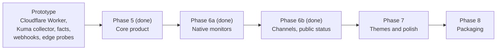

# Roadmap

Where Uptellis is going. Today it is a status page and monitor that runs on Cloudflare or in Docker: native monitors (HTTP, TCP, ping, TLS) run from the instance and from agents in private networks, next to the Uptime Kuma collector, facts pushers and signed webhooks; failures are confirmed before they page, alerts go to six kinds of channel, and a site can publish a public summary, badges and a widget ([architecture.md](architecture.md)).

Uptellis stays on 0.x releases for now; there is no 1.0 date. A 1.0 comes when the project decides the product is finished and proven, not at the end of a particular phase.

Phases 1 to 4 built the prototype. **Phase 5 is done** (0.2.0): profiles, the Docker runtime, accounts and public or private pages. **Phase 6a is done** (0.3.0): native monitors, the private-network agent, confirmation, maintenance windows and down and up cards. **Phase 6b is done** (0.4.0): notification channels (Discord, Slack, signed webhooks, ntfy, Telegram, email) and public summaries, badges and an embeddable widget. Phase 7 (themes and polish) is next.

## Phase 5: core product (done, 0.2.0)

Make Uptellis a product anyone can run and share, not only a private dashboard.

- **Profiles.** A profile declares a system's fact groups, keys, labels, formats, thresholds, highlights and topology; a site enables profiles in its config, and themes never name a fact themselves. Built in: `generic`, `uptime-kuma`, `forgejo-ha` ([profiles.md](profiles.md)).
- **Docker runtime.** The same app on any host: one container with Bun, SQLite in place of D1, a SQLite key-value table in place of KV, and a built-in scheduler in place of Cron Triggers. Cloudflare stays a first-class target; both runtimes share the engine, the model and the themes through one platform interface.
- **Accounts with Better Auth.** Users with roles (owner, admin, viewer), first-run setup, invites, optional GitHub and Google sign-in, JWTs with a JWKS endpoint, and site-scoped API keys for producers. The viewer and admin key gates are gone.
- **Public or private pages.** Each site is public or private; private sites answer 404 to anyone without a role.

## Phase 6a: native monitors (done, 0.3.0)

Monitor without any other tool in front, while keeping the Kuma collector, facts and webhooks as sources ([monitors.md](monitors.md)).

- **Checks.** HTTP(S) with status and keyword assertions, TCP, ping and TLS certificate expiry, configured per site and edited in admin.
- **Runners.** The instance itself (`builtin`: Cloudflare's edge runs HTTP and TCP, the Docker server all four) and `uptellis-agent` inside private networks, which reports out over HTTPS with a disk buffer, so nothing inbound has to be opened.
- **Confirmation.** Retries per runner and a quorum across runners before a service is down; too few agreeing runners show degraded, never page.
- **Maintenance windows.** One-off and weekly windows in any time zone; covered services show maintenance, never downtime, and nobody is paged.
- **Cards.** Down and up cards for services, beside the stale cards for silent sources.

## Phase 6b: reach (done, 0.4.0)

- **Notification providers.** Beyond Discord: email, Slack, Microsoft Teams, Telegram, ntfy, generic signed webhooks and more, per site and per incident kind.
- **Public summaries and embeds.** An allow-list of what a public page and its JSON summary show (the field list already exists in the site config), plus embeddable status badges and widgets.

## Phase 7: themes and polish

- **New themes.** A handful of themes with genuinely different looks, not only terminal styles: for example a classic status page, an editorial page, a modern dashboard, a wallboard for a TV, a friendly rounded look and a minimal one-line page. Each starts as a mock-up with the same demo data; the ones that work become themes.
- **Polish.** The existing themes (sys.status, Control Room, Session) get their remaining layout fixes, and the README gets screenshots.

## Phase 8: packaging

- **Deploy to Cloudflare.** A button that provisions the Worker, D1, KV and the crons in one step.
- **Docs site.** Installation for both runtimes, configuration reference, monitors and agents, channels, public status, profile and theme guides, the ingest API for writing your own producer.
- **Public demo.** A demo instance anyone can open.
- **Images.** Multi-arch images on GHCR, signed, with an SBOM and provenance, are already built for every release; they become public when the project decides.

Plans change with feedback: open an issue to discuss a feature or to help with one.
