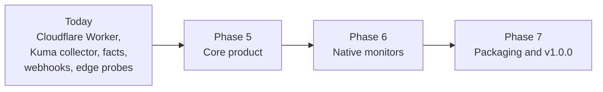

# Roadmap

Where Uptellis is going. Today it is a status page and monitoring hub on Cloudflare Workers: producers (the Uptime Kuma collector, facts pushers, signed webhooks) and the Worker's own edge probes report into one model, rendered by three themes, with incidents, Discord cards for silent sources and an admin panel with config revisions and key rotation ([architecture.md](architecture.md)). The phases below take it to a 1.0 that runs anywhere, monitors on its own and is easy to install.

Phases 1 to 4 built the current prototype; Phase 5 starts the public roadmap.

## Phase 5: core product

Make Uptellis a product anyone can run and share, not only a private dashboard.

- **Profiles.** A profile is a set of fact groups plus a producer for a specific system, with the presentation that goes with it. Today the one example lives in [`profiles/forgejo-ha`](../profiles/forgejo-ha/README.md); Phase 5 makes profiles first class: a profile declares its groups, keys, labels and thresholds, a site enables it in its config, and the admin panel shows how to install its producer.
- **Docker runtime.** The same app on any host: one container with Bun, SQLite in place of D1 and an in-process cache in place of KV, a built-in scheduler in place of Cron Triggers. Cloudflare stays a first-class target; both runtimes share the engine, the model and the themes.
- **Accounts with Better Auth.** Real sign-in instead of shared keys: users with roles (for example admin and viewer), sessions, JWTs for the API and API keys for producers and automation. The viewer and admin key gates stay as an option for small setups.
- **Public or private pages.** Each site chooses: private behind sign-in, or public with an allow-list of what is shown (the public field list already exists in the site config), plus embeddable status badges and widgets.

## Phase 6: native monitors

Monitor without any other tool in front, while keeping the Kuma collector, facts and webhooks as sources.

- **Checks.** HTTP(S) with status and keyword assertions, TCP port, ping, and TLS certificate expiry, configured per site.
- **Server checker.** Checks run by the Docker runtime from wherever it is deployed.
- **Edge checker.** Checks run from Cloudflare's edge, extending today's probes to the full check set.
- **Private-network agent.** A small agent inside a private network that runs checks there and reports out over the signed ingest, so nothing inbound has to be opened.
- **Alert confirmation.** A failure is confirmed (retries, and optionally a second location) before it opens an incident or alerts anyone.
- **Maintenance windows.** Scheduled windows during which checks show maintenance, never downtime, and nobody is paged.
- **Notification providers.** Beyond Discord: email, Slack, Microsoft Teams, Telegram, ntfy, generic webhooks and more, per site and per incident kind, for service outages as well as silent sources.

## Phase 7: packaging and v1.0.0

- **Images.** Multi-arch images on GHCR, signed, with an SBOM and provenance.
- **Deploy to Cloudflare.** A button that provisions the Worker, D1, KV and the crons in one step.
- **Docs site.** Installation for both runtimes, configuration reference, profile and theme guides, the ingest API for writing your own producer.
- **v1.0.0.** A stable config format, ingest API and theme contract under SemVer.

Plans change with feedback: open an issue to discuss a feature or to help with one.
