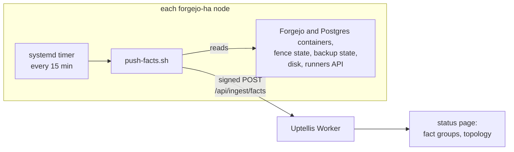

# Profile: forgejo-ha

A **profile** is a set of fact groups plus a producer for one specific kind of system. The producer runs on the system, gathers its state as typed facts, and pushes them to Uptellis over the signed facts ingest (`POST /api/ingest/facts`). The Worker stores facts generically; how the page labels, orders, formats and levels the groups below, which facts it highlights and how they shape the topology is the code profile `forgejo-ha` in [`src/shared/profiles/forgejo-ha.ts`](../../src/shared/profiles/forgejo-ha.ts). A site turns it on with `"profiles": ["forgejo-ha"]` in its config; without it the same facts still render, with humanised labels and plain formats. What a profile is and how to write one: [docs/profiles.md](../../docs/profiles.md).

This profile covers a highly available, self-hosted Forgejo on two nodes, with streaming Postgres replication between them and a **fence** that decides which node may serve, so a standby never serves while the primary is alive. How it fits into the rest of Uptellis is in [docs/architecture.md](../../docs/architecture.md).



## Fact groups

The pusher sends these groups, in this order. Every probe is best effort: a probe that fails drops its facts, it never fails the push.

| Group | Facts |
| --- | --- |
| `forgejo` | this node's name, whether Forgejo runs here, which node serves, the Forgejo version, the public `/api/healthz` status code |
| `replication` | Postgres role (`primary` or `standby`), the standby's streaming state and replay lag in seconds, the peer node and whether it is reachable |
| `fence` | the fence decision (`serve` or `fence`) and its reason, this node's timeline, the peer's role and timeline |
| `backup` | time and result of the last offsite backup, its snapshot id, size and duration (or the failed step), the next scheduled run |
| `runners` | Forgejo Actions runners online, total, and which are offline |
| `disk` | used and total bytes and percent of the root filesystem (warn from 80%, crit from 90%) |
| `watchdog` | whether the external watchdog (an Uptime Kuma status page) answers, and its HTTP code |

Each fact carries a severity where one makes sense (a failed backup is `crit`, a missing standby is `warn`) and stays current for 30 minutes (`FRESH_FOR_S`, two missed runs). Thresholds such as the replication lag and the maximum backup age are set per site in the config (`thresholds`). Facts carry host names only: the peer's address is mapped to its machine name, and any address or email left in free text is replaced before the payload is built.

## Files

| File | What it is |
| --- | --- |
| `push-facts.sh` | the producer: gathers, builds a `FactsPayload`, signs and POSTs it |
| `systemd/uptellis-push-facts.service` | a oneshot service that runs it once, hardened (`ProtectSystem`, `PrivateTmp`, `NoNewPrivileges`) |
| `systemd/uptellis-push-facts.timer` | runs the service 3 minutes after boot and every 15 minutes after that |

The script needs `bash`, `curl`, `openssl`, `python3` and `docker` on the node. It reads the forgejo-ha stack (its `.env`, state directory and the notify env holding a Forgejo token with `read:admin` for the runners list) and never writes to it; the locations are set by `FORGEJO_HA_STACK`, `FORGEJO_HA_STATE` and `NOTIFY_ENV`, with defaults in the script's header.

## Install

1. **Create the source and its key.** In `/admin`, tab **Sources**, add a source of kind `facts` (for example `facts:app-1`) with the expected interval `900` seconds and a key id (for example `facts-1`). Copy the secret; it is shown once.

2. **Install the script** on the node as root:

   ```sh
   install -m 755 push-facts.sh /usr/local/sbin/uptellis-push-facts
   ```

3. **Write the config** `/etc/uptellis/ingest.env`, mode 600, owned by root (`INGEST_ENV` points elsewhere):

   ```sh
   install -d -m 700 /etc/uptellis
   install -m 600 /dev/null /etc/uptellis/ingest.env
   ```

   ```ini
   INGEST_URL=https://status.example.com
   KEY_ID=facts-1
   INGEST_KEY=<the secret from step 1>
   ```

   `INGEST_URL` is the base URL of your Uptellis deployment, https only. Add `CF_ACCESS_CLIENT_ID` and `CF_ACCESS_CLIENT_SECRET` if an identity-aware proxy (Cloudflare Access) sits in front of ingest. The script refuses to run when the file is readable by anyone but its owner, and the key never appears on a command line, in the environment or in the logs.

4. **Try it** without sending anything:

   ```sh
   /usr/local/sbin/uptellis-push-facts --dry-run
   ```

   It prints the request it would send: the signed headers, a blank line, and the JSON body.

5. **Enable the timer:**

   ```sh
   cp systemd/uptellis-push-facts.service systemd/uptellis-push-facts.timer /etc/systemd/system/
   systemctl daemon-reload
   systemctl enable --now uptellis-push-facts.timer
   ```

6. **Check it.** `systemctl start uptellis-push-facts.service` pushes once; `journalctl -u uptellis-push-facts.service` shows `accepted (202, ...)` or the HTTP status and reason of a rejection. The Sources tab shows the source as fresh with a recent "last used".

Install it on both nodes, each with its own source and key id, so the page still hears from the standby when the primary is down.

To rotate the key, use **Rotate** in the Sources tab and replace the `INGEST_KEY=` line; the next run signs with the new secret and promotes it ([OPERATIONS.md](../../docs/OPERATIONS.md#ingest-keys)).

## Signing

The script signs exactly like every other producer (`src/shared/signing.ts`): a lower-case hex HMAC-SHA256, keyed with the UTF-8 bytes of `INGEST_KEY`, over

```text
v1
<KEY_ID>
<unix seconds>
<32 lower-case hex nonce>
POST
/api/ingest/facts
<sha256 hex of the body>
```

sent in the key id, timestamp, nonce and signature headers next to the JSON body. The Worker accepts a timestamp within 120 seconds of its clock, so keep the node's clock in sync (NTP).

## Writing a profile for another system

Any script or service can be a profile's producer: gather facts, group them, sign, POST. Keep group names short and lower case (`^[a-z][a-z0-9_-]{0,31}$`), keys camelCase, values typed (`number`, `string`, `boolean`, or a `timestamp` hint on an ISO string), severities `ok`, `warn`, `crit` or `info`, and never put addresses, emails or tokens in a value: the Worker rejects the payload if you do. The payload schema is `FactsPayload` in `src/shared/schemas/ingest.ts`.

Phase 5 makes profiles a first-class feature: a profile will declare its groups, labels and thresholds, a site will enable it in its config, and the admin panel will show how to install its producer ([roadmap](../../docs/roadmap.md)).
